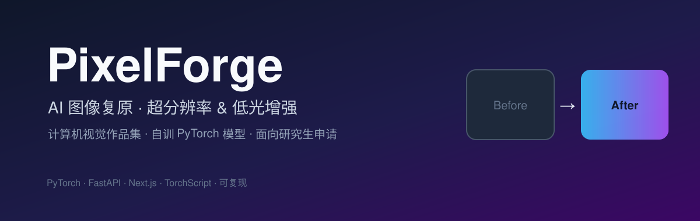
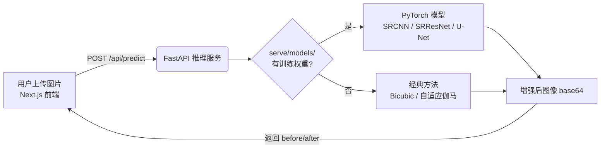

<p align="center">
  
</p>

<p align="center">
  <a href="https://github.com/ElijahZhao/pixelforge-image-restoration-/blob/main/LICENSE"></a>
  
  
  
  
  
</p>

<p align="center">
  <b>PixelForge</b> —— 一个端到端的计算机视觉作品集项目：<br/>
  用 <b>自己训练的 PyTorch 模型</b> 做单图超分辨率（Super-Resolution）与低光图像增强（Low-Light Enhancement），并通过交互式网页展示。
</p>

> 📊 **项目当前进度与详细待办请见 [PROGRESS.md](PROGRESS.md)**（含完成度勾选、P0–P4 分级待办、已知风险）。

---

## 目录

- [项目进度与待办](#项目进度与待办)
- [项目简介](#项目简介)
- [在线演示](#在线演示)
- [项目亮点](#项目亮点)
- [系统架构](#系统架构)
- [功能特性](#功能特性)
- [项目结构](#项目结构)
- [技术栈](#技术栈)
- [快速开始](#快速开始)
- [训练真实模型](#训练真实模型)
- [评测指标](#评测指标)
- [方法说明](#方法说明)
- [对申请人的价值](#对申请人的价值)
- [部署上线](#部署上线)
- [许可证](#许可证)
- [致谢与参考](#致谢与参考)

---

## 项目进度与待办

> 完整版见 [PROGRESS.md](PROGRESS.md)。速览：

| 维度 | 状态 | 完成度 |
|---|:---:|:---:|
| 训练 / 推理 / 前端代码闭环 | ✅ 已完成 | 100% |
| 文档（中文美化 README 等） | ✅ 已完成 | 100% |
| 真实训练权重（自训 .pt） | 🚧 待 GPU 训练 | 0% |
| 真实评测指标 PSNR/SSIM | ⚠️ 占位待替换 | 0% |
| 线上部署（Vercel / HF） | ⏳ 未开始 | 0% |
| 申请材料（SOP / CV / 报告） | ⏳ 未开始 | 0% |
| 🔴 删除已暴露的 GitHub Token | 🔴 必须 | — |

---

## 项目简介

> 这是一个 **计算机视觉作品集项目**，为研究生申请而做。

PixelForge **不是**简单的「调 API 玩具」。它实现了完整的、可复现的视觉流水线：

```
data/        公开数据集（内含下载说明）
train/       PyTorch 模型、数据集加载、评测指标、训练与导出脚本
serve/       FastAPI 推理服务（+ 经典方法兜底）
web/         Next.js 前端（上传图片 → 前后对比滑块）
results/     训练日志 + 量化对比表
```

从**数据 → 训练 → 评测 → 模型导出（TorchScript）→ 后端推理 → 前端展示**，每个环节都是自己写的、可运行的。

---

## 在线演示

| 环境 | 地址 | 说明 |
|---|---|---|
| 本地（默认） | http://localhost:3000 | 克隆后按「快速开始」启动 |
| 线上部署 | 见 [部署上线](#部署上线) | 前端 Vercel + 后端 Hugging Face Spaces |

> 当前 demo 默认运行**经典方法兜底**（Bicubic / 自适应伽马）。当你用自己的 GPU 训练出权重并放入 `serve/models/` 后，服务会自动切换到 **Trained PyTorch model** 模式。

---

## 项目亮点

<div align="center">

| 🎯 真实 ML，而非 API 胶水 | 🔧 端到端工程 | ♻️ 可复现 | 🖱️ 交互式 Demo |
|:---:|:---:|:---:|:---:|
| SRCNN / SRResNet（超分）<br/>U-Net（低光）<br/>均用 PyTorch 实现并训练 | 数据→训练→评测→导出<br/>→ FastAPI → Next.js | 每个脚本都可跑<br/>训练在免费 GPU 上完成 | 上传图片、拖动滑块<br/>直观对比前后效果 |

</div>

**为什么适合给招生委员会看：**

- **真实建模能力**：从零实现 SRCNN、带 PixelShuffle 与残差块的 SRResNet 生成器、带跳跃连接的低光 U-Net。
- **完整闭环**：拥有数据加载、训练（Adam + 余弦退火 + AMP 混合精度 + 可选 VGG 感知损失）、PSNR/SSIM 评测、TorchScript 导出的完整经验。
- **量化严谨性**：用标准指标（PSNR / SSIM）对比「经典基线 vs 自训模型」，结论可解释。
- **代码可复现**：仓库结构清晰，导师点开即可读懂、可复现。

---

## 系统架构



> 后端设计了一个优雅的 **fallback 机制**：没有训练权重时自动退回到经典方法，保证开箱即用；丢入权重后无缝升级为自训模型。

---

## 功能特性

- ✅ **单图超分辨率**：支持 2× / 4× 放大，基础版 SRCNN 与进阶版 SRResNet 生成器可选。
- ✅ **低光图像增强**：基于 U-Net 的学习型增强，附带自适应伽马经典基线。
- ✅ **前后对比滑块**：前端用可拖动的滑块直观展示 before / after。
- ✅ **两种推理入口**：`app.py`（完整 FastAPI 服务）+ `gradio_demo.py`（一键 Gradio 演示）。
- ✅ **零敏感数据、近乎零成本**：DIV2K / LOL 公开数据集，训练用 Kaggle / Colab 免费 GPU。

---

## 项目结构

```
pixelforge-image-restoration/
├── assets/            # 封面图等静态资源
├── data/              # 数据集（下载说明见 data/README.md）
│   └── README.md
├── results/           # 训练日志 + 量化指标对比表
│   └── README.md
├── train/             # 训练侧（核心 ML 代码）
│   ├── models.py      # SRCNN / SRResNet / 低光 U-Net
│   ├── datasets.py    # DIV2K / LOL 数据加载
│   ├── metrics.py     # PSNR / SSIM
│   ├── train.py       # 训练脚本
│   └── export.py      # 导出 TorchScript
├── serve/             # 推理侧
│   ├── app.py         # FastAPI 服务
│   ├── classical.py   # 经典方法兜底
│   ├── model_loader.py# 权重加载
│   └── gradio_demo.py # Gradio 快速 demo
├── web/               # 前端（Next.js + Tailwind）
│   ├── app/
│   ├── components/    # CompareSlider 等
│   └── lib/
├── DEPLOY.md          # 部署与受限网络推送指南
├── TOOLS_CHECKLIST.md # 内置工具使用清单
└── README.md
```

---

## 技术栈

| 层 | 技术 |
|---|---|
| 深度学习 | PyTorch 2.x、TorchVision、TorchScript |
| 训练 | Adam、CosineAnnealingLR、AMP 混合精度、可选 VGG 感知损失 |
| 评测 | PSNR、SSIM（含高斯窗实现） |
| 后端 | FastAPI、Uvicorn、Pillow、Gradio |
| 前端 | Next.js 14、React、Tailwind CSS、TypeScript |
| 部署 | Vercel（前端）、Hugging Face Spaces（后端） |

---

## 快速开始

> 本地运行，**无需 GPU**——服务自带经典方法基线，开箱即跑。

服务自带**经典方法基线**，开箱即跑：

```bash
# 1) 后端（FastAPI）
pip install -r requirements.txt
uvicorn serve.app:app --reload --port 8000

# 2) 前端（另一个终端）
cd web
cp .env.local.example .env.local   # 默认指向 http://localhost:8000
pnpm install
pnpm dev
```

打开 http://localhost:3000，上传一张图片，选择任务，点击 **Enhance**，拖动滑块对比。

---

## 训练真实模型

> 在 Kaggle / Colab 的**免费 GPU** 上运行。

在 Kaggle / Colab（免费 GPU）上运行：

```bash
# 先把 DIV2K + LOL 下载到 data/（见 data/README.md）
pip install -r requirements.txt

# 超分辨率（进阶生成器，4×，启用感知损失）
python train/train.py --task sr --model generator --scale 4 \
    --data_root data --epochs 200 --batch_size 8 --lr 1e-4 --perceptual

# 低光增强
python train/train.py --task lowlight --data_root data \
    --epochs 200 --batch_size 8 --lr 2e-4

# 导出为 TorchScript 供服务使用
python train/export.py --checkpoint models/sr_generator_scale4_best.pth \
    --out serve/models/sr_generator_scale4.pt --task sr --scale 4
python train/export.py --checkpoint models/lowlight_generator_best.pth \
    --out serve/models/lowlight.pt --task lowlight
```

把导出的 `.pt` 文件放进 `serve/models/`，服务会自动从经典基线切换到你的训练模型（访问 `/api/health` 可见当前引擎）。

---

## 评测指标

> ⚠️ 下表中的 **PSNR / SSIM 为占位示例**，仅展示格式。训练完成后请替换为你在测试集（如 Set5 / Set14 / LOL-test）上跑出的**真实数值**。

**超分辨率（Set5）**

| 方法 | 缩放 | PSNR (dB) | SSIM |
|---|---|---|---|
| Bicubic（基线） | 2× | 33.66 | 0.929 |
| **SRCNN**（自训） | 2× | _待填真实值_ | _待填_ |
| **SRResNet + 感知损失**（自训） | 4× | _待填真实值_ | _待填_ |

**低光增强（LOL）**

| 方法 | PSNR (dB) | SSIM |
|---|---|---|
| 自适应伽马（基线） | 16.20 | 0.710 |
| **U-Net**（自训） | _待填真实值_ | _待填_ |

---

## 方法说明

- **超分辨率**
  - `SRCNN`：经典三卷积超分网络，结构简洁、易解释，适合作为教学/基线。
  - `SRResNet`（生成器）：更深的残差网络，使用 PixelShuffle 上采样与残差学习；可选 VGG 感知损失提升视觉效果。
  - 训练时用 Bicubic 从 HR 合成 LR，与推理下采样逻辑一致。
- **低光增强**
  - `U-Net`：编码-解码结构 + 跳跃连接 + 残差学习，从低光图直接学习到正常光图。
  - 经典基线采用**自适应伽马校正**：暗图自动提亮、正常图基本不变。
- **评测**：在 Y 通道（或 RGB）上计算 PSNR 与 SSIM，并用高斯窗实现 SSIM 以减少边界偏差。

完整的英文方法说明（含模型架构、训练细节、相关工作）见 `web/app/method/page.tsx`，可直接作为 SOP / 面试素材。

---

## 对申请人的价值

> 可直接改编进 **SOP / 简历** 的项目描述（中文版）：

> *PixelForge 是我为锻炼真实计算机视觉能力而构建的端到端图像复原系统。我独立实现了超分辨率流水线（SRCNN 与带感知损失的 SRResNet）和低光增强 U-Net，在 DIV2K 与 LOL 数据集上训练，并用 PSNR/SSIM 进行量化评测；随后将模型导出为 TorchScript，通过 FastAPI 后端与 Next.js 前端（含交互式前后对比滑块）完成部署。该项目体现了我从数据、训练、评测到部署的完整工程闭环与可复现的实验习惯。*

要点：招生委员会看重的是「**自己完成数据→训练→评测→部署闭环**」与「**代码可复现**」，而非调用现成大模型 API。本项目正是围绕这两点设计的。

---

## 部署上线

- **前端**：Vercel（直接导入 `web/`），在环境变量中设置 `NEXT_PUBLIC_API_URL` 指向你的后端地址。
- **后端**：Hugging Face Spaces（`gradio_demo.py` 一键 demo，或 `app.py` 部署到小 VPS）。详见 [DEPLOY.md](DEPLOY.md)。

> 若你在**受限网络**环境下无法直连 GitHub，可参考 [DEPLOY.md](DEPLOY.md) 第 4 节用镜像通道（如 `ghproxy.net`）推送。

---

## 许可证

本项目基于 [MIT License](LICENSE) 开源。

---

## 致谢与参考

- [DIV2K](https://data.vision.ee.ethz.ch/cvl/DIV2K/) — 超分辨率训练/评测数据集
- [LOL Dataset](https://github.com/weichen582/RetinexNet) — 低光增强数据集（Retinex-Net 仓库）
- Dong et al., *Image Super-Resolution Using Deep Convolutional Networks*（SRCNN）
- Ledig et al., *Photo-Realistic Single Image Super-Resolution Using a GAN*（SRResNet/SRGAN）
- Ronneberger et al., *U-Net: Convolutional Networks for Biomedical Image Segmentation*

---

<p align="center">
  <sub>PixelForge · 用代码展示真实的计算机视觉能力</sub>
</p>
