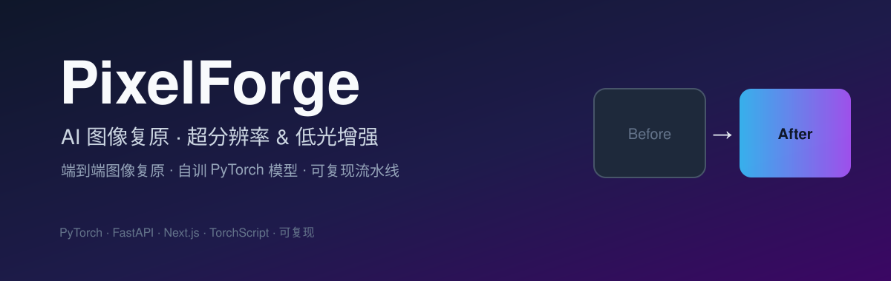
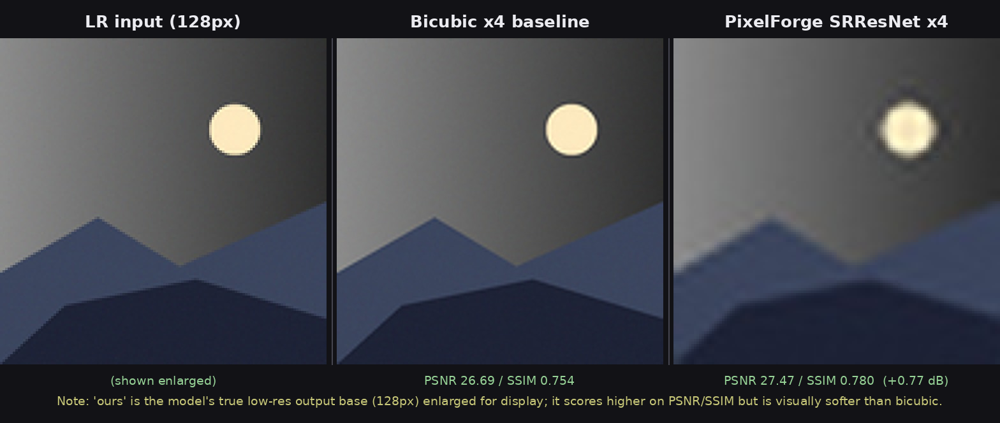
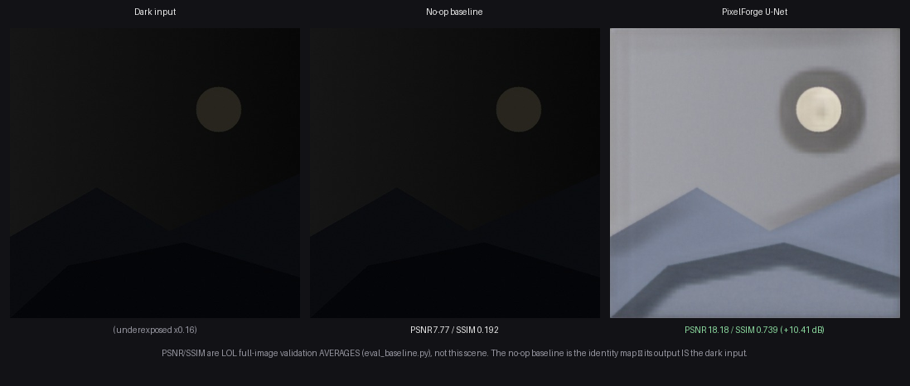
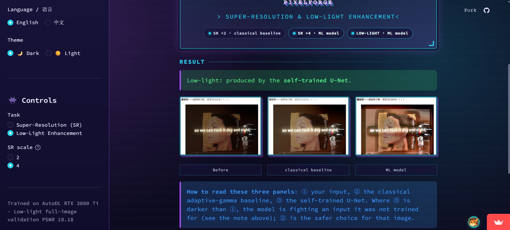
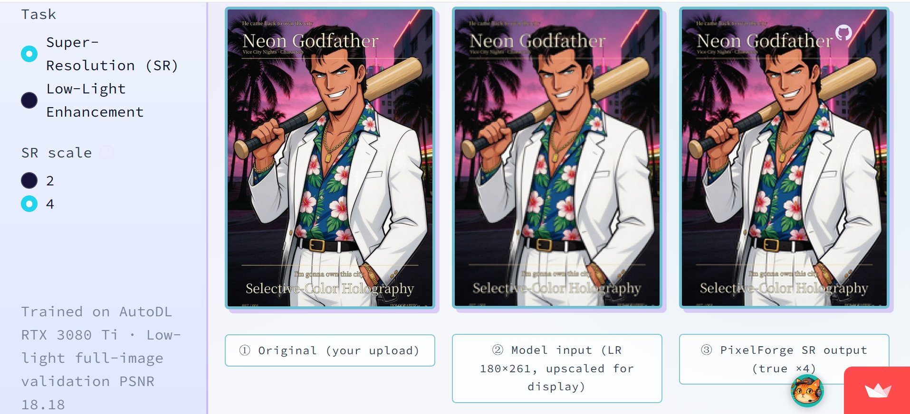
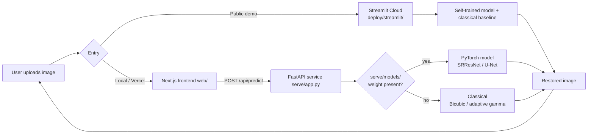

<p align="center">
  
</p>

<p align="center">
  <a href="https://pixelforge-image-restoration.streamlit.app/"></a>
  
  
  <a href="https://github.com/ElijahZhao/pixelforge-image-restoration-/actions/workflows/ci.yml"></a>
  <a href="LICENSE"></a>
</p>

<p align="center">
  <b>PixelForge</b>: an end-to-end image restoration pipeline<br/>
  Self-trained PyTorch models for single-image super-resolution and low-light enhancement,
  built end to end from data to training, evaluation and deployment.
</p>

<p align="center">
  <a href="https://pixelforge-image-restoration.streamlit.app/"><b>Live demo</b></a> &nbsp;·&nbsp;
  <a href="#-quick-start">Quick start</a> &nbsp;·&nbsp;
  <a href="#-results">Results</a> &nbsp;·&nbsp;
  <a href="README.zh-CN.md">中文</a>
</p>

---

## 🎯 What it is

PixelForge implements a **complete, reproducible** vision pipeline rather than a wrapper around an API:

```
data → training → evaluation → export (TorchScript) → backend inference → frontend
```

Every stage is written from scratch and runnable. Two self-trained weights
(`sr_generator_scale4.pt`, `lowlight.pt`) ship with the repo, so a clone runs out of the box.
Current status and graded TODOs: [PROGRESS.md](PROGRESS.md).

## ✨ Highlights

- **Real modelling**: SRCNN, an SRResNet generator with PixelShuffle + residual blocks, and a low-light U-Net with skip connections, all written from scratch.
- **Full training loop**: data loading, Adam + cosine annealing + AMP mixed precision + optional VGG perceptual loss, PSNR/SSIM evaluation, TorchScript export.
- **Quantitative comparison**: classical baselines vs. self-trained models on the same validation set; scripts and per-epoch logs are committed and recomputable.
- **Graceful fallback**: classical baselines serve requests when no weight is present; drop a weight in and the service switches to the ML engine, visible via `GET /api/health`.
- Production hygiene is not an afterthought: CI (tests + coverage gate + dependency audit + frontend build), a non-root Docker image, per-IP rate limiting, and API docs.

## 🖼️ Showcase

> Outputs below are produced on CPU with the repo's real weights. The first two are side-by-side comparisons (left: low-quality input / classical baseline, right: PixelForge self-trained model); the last two are screenshots of the public demo running live, one per task.

**Super-resolution ×4: Bicubic baseline vs. self-trained SRResNet**



> The self-trained SRResNet scores higher PSNR/SSIM than bicubic (+0.77 dB) but looks softer / greyer (measured: output gradient mean 1.39 vs. 1.45 for bicubic). This is typical of perceptual-loss training: it optimises feature-space similarity, not pixel sharpness. The metric and the visual result point in different directions.

**Low-light enhancement: dark input → adaptive-gamma baseline vs. self-trained U-Net**



> The self-trained U-Net gains +10.41 dB PSNR and +0.547 SSIM on the same caliber, clearly ahead of the gamma baseline in both brightness recovery and structure retention.

> Comparison figures are generated by `scripts/make_demo.py` + `scripts/make_compare.py` from the repo's real weights; run them to reproduce.

**Running live** — the public demo, low-light task on a real photo. Left to right: your input, the classical adaptive-gamma baseline, the self-trained U-Net. The service picked the ML engine and ran the real weights on CPU.



> The demo is at <https://pixelforge-image-restoration.streamlit.app/>. It ships a bilingual UI, a dark/light theme toggle, and the three-panel view above so the low-res input the model actually sees is visible, not hidden.

**Running live, super-resolution ×4** — same demo, other task. Left to right: your upload, the model input (LR 180×261, upscaled for display), and the true ×4 output from the self-trained SRResNet. The sidebar keeps the training provenance on display.



## 📊 Results

> Numbers are measured by [`scripts/eval_baseline.py`](scripts/eval_baseline.py) on the same validation set with the same PSNR/SSIM implementation, so the only variable is the method. Per-epoch logs are under [`results/`](results/).

| Task | Baseline | Ours | Gain |
|---|---|---|---|
| **Super-resolution ×4** | Bicubic: PSNR 26.69 / SSIM 0.754 | **PSNR 27.47 / SSIM 0.780** | **+0.77 dB / +0.026** |
| **Low-light enhancement** | No-op: PSNR 7.77 / SSIM 0.192 | **PSNR 18.18 / SSIM 0.739** | **+10.41 dB / +0.547** |

**Note on methodology**: the table is measured on the full-image validation set, which differs from the random-crop caliber in the training logs — the two are not directly comparable (training-log best: SR 27.39, low-light 18.59, a normal caliber difference). Everything is reproducible from `results/train_log_*.csv` + `scripts/eval_baseline.py`.

What this does **not** claim: SOTA. SR ×4 at 27.47 dB beats the bicubic baseline but is below
large-dataset academic SOTA (30+ dB) — the training set and model capacity are small. The
low-light gain is relative to a no-op baseline, not to other published methods.

## 🧩 Features

- **SR ×4**: self-trained SRResNet generator with perceptual loss. The only super-resolution slot that has a trained, exported weight.
- **SR ×2**: no trained weight; requests fall back to a classical bicubic + unsharp path. Train one with `train/train.py --task sr --model srcnn --scale 2` to use a model at ×2.
- **Low-light enhancement**: self-trained low-light U-Net, plus an adaptive-gamma classical fallback and an exposure gate for inputs that are dark but not underexposed photos.
- **Before/after**: side-by-side in the Streamlit demo; draggable slider in the Next.js frontend.
- **Two deploy entry points**: `deploy/streamlit/streamlit_app.py` (public demo) + `serve/app.py` (FastAPI service).

## 🏗️ Architecture


```mermaid
flowchart LR
    A[User uploads image] --> B{Entry}
    B -->|Public demo| C[Streamlit Cloud<br/>deploy/streamlit/]
    B -->|Local / Vercel| D[Next.js frontend web/]
    C --> E[Self-trained model + classical baseline]
    D -->|POST /api/predict| F(FastAPI service serve/app.py)
    F --> G{serve/models/<br/>weight present?}
    G -->|yes| H[PyTorch model<br/>SRResNet / U-Net]
    G -->|no| I[Classical<br/>Bicubic / adaptive gamma]
    E --> J[Restored image]
    H --> J
    I --> J
    J --> A
```

Request flow: `web/` → `POST /api/predict` → `serve/app.py` picks the ML engine if a weight is
loaded for that task/scale, otherwise a classical baseline (bicubic + unsharp for SR, adaptive
gamma for low-light). `GET /api/health` reports which engine each slot is using. Full interface
in [`docs/API.md`](docs/API.md).

## 🚀 Quick start

> Runs locally without a GPU. Classical baselines work out of the box; the repo ships trained weights, so the service switches to the ML engine automatically.

```bash
# 1) Backend (FastAPI)
pip install -r requirements.txt
uvicorn serve.app:app --reload --port 8000

# 2) Frontend (separate terminal)
cd web
cp .env.local.example .env.local   # points to http://localhost:8000 by default
pnpm install
pnpm dev
```

Open http://localhost:3000, upload an image, pick a task, hit **Enhance**, drag the slider.
No local setup? Open the public demo at <https://pixelforge-image-restoration.streamlit.app/>
(the free tier sleeps and needs a wake-up on first visit).

**Docker** (backend only)

```bash
docker build -t pixelforge-serve .
docker run -p 8000:8000 pixelforge-serve
```

The image bundles the trained weights and starts in ML mode. The frontend is a separate build
target and is not part of this image.

## 🧪 Tests

```bash
# unit + API smoke + real-weight integration tests (CPU-friendly)
python -m pytest

# with coverage (gate 75%, configured in pyproject.toml)
python -m pytest --cov --cov-report=term-missing

# frontend unit tests + type-check
cd web && pnpm install && pnpm test
cd web && pnpm exec tsc --noEmit
```

Expected: `32 passed, 1 skipped` (20 training unit tests + 9 API smoke tests + 3 real-weight
integration tests; the skip is the E2E script). The integration tests load the real weights
under `serve/models/` through the full inference path, confirming the ML engine actually serves
rather than silently degrading to the classical baseline.

The E2E browser test (`tests/e2e/test_e2e.py`) drives a real Chromium through the full upload
flow. It boots two servers and a browser, so it is skipped under pytest by default; run it
directly, or set `PIXELFORGE_RUN_E2E=1`.

CI (`.github/workflows/ci.yml`) runs three jobs: pytest with a coverage gate, `pip-audit` over
the lock file, and the frontend type-check + tests + build.

## 🧰 Training

Requires a GPU. Prepare data first (builds directories and prints download URLs; does not fetch
the multi-GB datasets):

```bash
bash scripts/download_data.sh

# Super-resolution (4×, with perceptual loss)
python train/train.py --task sr --model generator --scale 4 \
    --data_root data --epochs 200 --batch_size 8 --lr 1e-4 --perceptual

# Low-light (U-Net)
python train/train.py --task lowlight --data_root data \
    --epochs 200 --batch_size 8 --lr 2e-4

# Export to TorchScript for the service
python train/export.py --checkpoint models/sr_generator_scale4_best.pth \
    --out serve/models/sr_generator_scale4.pt --task sr --scale 4
```

Drop the exported `.pt` into `serve/models/` and the service picks it up on restart.

## 🔬 Method

- **Super-resolution**
  - `SRCNN`: classic three-conv SR network, simple and interpretable as a baseline.
  - `SRResNet` (generator): deeper residual network with PixelShuffle upsampling and residual learning, optional VGG perceptual loss.
  - LR is synthesised from HR by bicubic downscaling during training, matching the inference downsampling.
- **Low-light enhancement**
  - `U-Net`: encoder-decoder with skip connections and residual learning, mapping low-light to normal-light (trained on LOL).
  - Classical baseline uses adaptive gamma: dark images brighten, already-lit images stay put.
- **Evaluation**: PSNR and SSIM on the Y channel (or RGB), with a Gaussian-window SSIM to reduce boundary bias.

A longer write-up of the architectures, training details and related work lives at `web/app/method/page.tsx` and renders at `/method` on the site.

## 📁 Structure

```
pixelforge-image-restoration/
├── assets/            # banner, real demo comparison figures
├── data/              # datasets (download notes; data itself not committed)
├── results/           # training logs + quantitative comparison
├── train/             # training-side core code
│   ├── models.py      # SRCNN / SRResNet / low-light U-Net
│   ├── datasets.py    # DIV2K / LOL loaders
│   ├── metrics.py     # PSNR / SSIM
│   ├── train.py       # training script
│   ├── export.py      # TorchScript export
│   └── tests/         # unit tests (CPU-friendly)
├── serve/             # inference side
│   ├── app.py         # FastAPI service (rate limiting + resource guards)
│   ├── classical.py   # classical fallbacks
│   ├── model_loader.py# weight loading + U-Net size adaptation
│   └── models/        # self-trained TorchScript weights (committed)
├── deploy/            # streamlit/ (live), hf_space/ (alternative)
├── web/               # frontend (Next.js + Tailwind)
├── scripts/           # helpers (demo figures, evaluation, data setup)
├── tests/             # API smoke + real-weight integration + E2E
├── docs/              # API.md (interface), OPERATIONS.md (ops), DEPLOY_DIAGNOSIS.md
├── Dockerfile         # inference service image
├── DEPLOY.md          # deployment guide
├── CHANGELOG.md       # version history
├── CONTRIBUTING.md    # contribution guide
├── CITATION.cff       # citation metadata
├── PROGRESS.md        # status and graded TODOs
└── README.zh-CN.md    # 中文 README
```

## 🛠️ Stack

| Layer | Tech |
|---|---|
| Deep learning | PyTorch 2.x, TorchVision, TorchScript |
| Training | Adam, CosineAnnealingLR, AMP mixed precision, optional VGG perceptual loss |
| Metrics | PSNR, SSIM (Gaussian-window implementation) |
| Backend | FastAPI / Uvicorn, Pillow |
| Frontend | Next.js 14, React 18, Tailwind CSS, TypeScript |
| Deploy | Streamlit Community Cloud (public demo), Docker, Vercel (optional) |

## ☁️ Deployment

**Public demo (live)**: Streamlit Community Cloud deploys straight from the repo, entry
`deploy/streamlit/streamlit_app.py` (self-contained). Steps in
[`deploy/streamlit/DEPLOY_STREAMLIT.md`](deploy/streamlit/DEPLOY_STREAMLIT.md).

**Local / self-hosted**: the backend `serve/app.py` runs on a VPS or Hugging Face Spaces
(alternative package in `deploy/hf_space/`); the frontend `web/` deploys to Vercel with
`NEXT_PUBLIC_API_URL` pointing at your backend. See [DEPLOY.md](DEPLOY.md).

Behind a restricted network that cannot reach GitHub directly, see [DEPLOY.md](DEPLOY.md) for
pushing via a mirror.

## 🗺️ Roadmap

The engineering is complete and live; the remaining items are optional extensions (graded
detail in [PROGRESS.md](PROGRESS.md)):

- `SRCNN ×2` training: currently `TBD` (untrained); train one with `train/train.py --model srcnn --scale 2` so ×2 also runs the ML engine.
- Extended materials: English project report / slides.

## 📄 License & citation

MIT — see [LICENSE](LICENSE). Contribution guide in [CONTRIBUTING.md](CONTRIBUTING.md),
version history in [CHANGELOG.md](CHANGELOG.md), citation info in [CITATION.cff](CITATION.cff).

## 🙏 Acknowledgements

- [DIV2K](https://data.vision.ee.ethz.ch/cvl/DIV2K/) — super-resolution dataset
- [LOL Dataset](https://github.com/weichen582/RetinexNet) — low-light dataset (Retinex-Net repo)
- Dong et al., *Image Super-Resolution Using Deep Convolutional Networks* (SRCNN)
- Ledig et al., *Photo-Realistic Single Image Super-Resolution Using a GAN* (SRResNet / SRGAN)
- Ronneberger et al., *U-Net: Convolutional Networks for Biomedical Image Segmentation*

---

<p align="center">
  <sub>PixelForge · end-to-end image restoration pipeline &nbsp;·&nbsp; <a href="https://pixelforge-image-restoration.streamlit.app/">Live Demo</a></sub>
</p>
