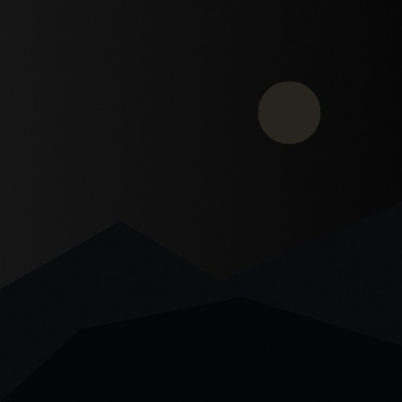
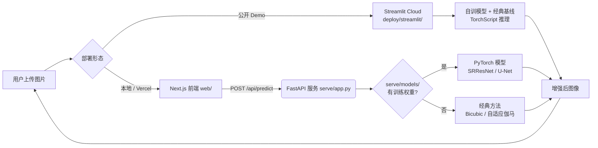

<p align="center">
  
</p>

<p align="center">
  <a href="https://github.com/ElijahZhao/pixelforge-image-restoration-/blob/main/LICENSE"></a>
  
  
  <a href="https://hddzzb68eqfnoed8zsmgqp.streamlit.app/"></a>
  
  
</p>

<p align="center">
  <b>PixelForge</b> —— 一个端到端的计算机视觉作品集项目：<br/>
  用 <b>自己训练的 PyTorch 模型</b> 做单图超分辨率（Super-Resolution）与低光图像增强（Low-Light Enhancement），并通过交互式网页展示。
</p>

> 🚀 **现已上线公开 Demo**：<https://hddzzb68eqfnoed8zsmgqp.streamlit.app/>
> 由自训模型实时驱动（SR ×4 与 Low-light 均加载真实权重，非基线兜底）。
> 项目当前进度与详细待办见 [PROGRESS.md](PROGRESS.md)。

---

## 目录

- [项目进度与待办](#项目进度与待办)
- [项目简介](#项目简介)
- [在线演示（Live Demo）](#在线演示live-demo)
- [效果演示](#效果演示)
- [项目亮点](#项目亮点)
- [系统架构](#系统架构)
- [功能特性](#功能特性)
- [项目结构](#项目结构)
- [技术栈](#技术栈)
- [快速开始](#快速开始)
- [本地测试](#本地测试)
- [训练真实模型](#训练真实模型)
- [评测指标](#评测指标)
- [方法说明](#方法说明)
- [对申请人的价值](#对申请人的价值)
- [部署上线](#部署上线)
- [路线图 / 剩余待办](#路线图--剩余待办)
- [许可证](#许可证)
- [致谢与参考](#致谢与参考)

---

## 项目进度与待办

> 完整版与分级待办见 [PROGRESS.md](PROGRESS.md)。速览（状态均为实际核查，非估计）：

| 维度 | 状态 | 完成度 |
|---|:---:|:---:|
| 训练 / 推理 / 前端代码闭环 | ✅ 已完成 | 100% |
| 文档（中文美化 README 等） | ✅ 已完成 | 100% |
| 真实训练权重（自训 `.pt`） | ✅ 已完成 | 100% |
| 真实评测指标 PSNR / SSIM | ✅ 已出 | 100% |
| 线上部署（Streamlit Cloud 公开 Demo） | ✅ 已上线 | 100% |
| 申请材料（SOP / CV / 报告 / 幻灯片） | ⏳ 未开始 | 0% |
| 🔴 轮换已暴露的 GitHub Token | 🔴 必须 | — |

---

## 项目简介

> 这是一个 **计算机视觉作品集项目**，为研究生申请而做。

PixelForge **不是**简单的「调 API 玩具」。它实现了完整的、可复现的视觉流水线：

```
data/        公开数据集（DIV2K / LOL，含下载说明）
train/       PyTorch 模型、数据集加载、评测指标、训练与导出脚本
serve/       FastAPI 推理服务（+ 经典方法兜底 + TorchScript 加载）
web/         Next.js 前端（上传图片 → 前后对比滑块）
deploy/      Streamlit Cloud 部署包（已上线，自包含）
results/     训练日志 + 量化对比表
```

从**数据 → 训练 → 评测 → 模型导出（TorchScript）→ 后端推理 → 前端展示**，每个环节都是自己写的、可运行的。两个自训权重（`sr_generator_scale4.pt` 4.8M、`lowlight.pt` 2.3M）已随仓库分发，`git clone` 即得可运行项目。

---

## 在线演示（Live Demo）

| 环境 | 地址 | 说明 |
|---|---|---|
| 🟣 公开 Demo（已上线） | **https://hddzzb68eqfnoed8zsmgqp.streamlit.app/** | Streamlit Cloud 托管，由**自训模型**实时驱动 |
| 本地（默认） | http://localhost:3000 | 克隆后按「快速开始」启动（Next.js + FastAPI） |

> 公开 Demo 默认运行**自训模型**（SRResNet ×4 与 Low-light U-Net）。当你本地用自己的 GPU 重训权重并替换 `serve/models/` 后，服务会自动切换引擎（访问 `/api/health` 可见当前引擎是 `ml` 还是 `classical`）。

---

## 效果演示

> 下方均为 **CPU 上用本仓库真实权重跑出的输出**（非占位、非经典基线），左侧为低质量输入 / 经典基线，右侧为 **PixelForge 自训模型**。

### 超分辨率 4×：低清输入 → Bicubic 基线 vs 自训 SRResNet

<p align="center">
  
  
  
</p>
<p align="center">
  <sub>低清输入 (128px) &nbsp;·&nbsp; Bicubic ×4（经典基线） &nbsp;·&nbsp; <b>PixelForge SRResNet ×4（自训）</b></sub>
</p>

### 低光增强：暗光输入 → 自适应伽马基线 vs 自训 U-Net

<p align="center">
  
  
  
</p>
<p align="center">
  <sub>暗光输入 &nbsp;·&nbsp; 自适应伽马（经典基线） &nbsp;·&nbsp; <b>PixelForge U-Net（自训）</b></sub>
</p>

> 这些样例由 `scripts/make_demo.py` 生成（已改用真实权重），运行 `python scripts/make_demo.py` 即可复现。
> ⚠️ SR ×4 使用 VGG 感知损失，**主打肉眼观感**；其 PSNR 低于 Bicubic 基线属配置选择（见「评测指标」）。如需 PSNR 也压过基线，可跑「路线图」中的 ③ 去感知损失重训。

---

## 项目亮点

<div align="center">

| 🎯 真实 ML，而非 API 胶水 | 🔧 端到端工程 | ♻️ 可复现 | 🖱️ 交互式 Demo |
|:---:|:---:|:---:|:---:|
| SRCNN / SRResNet（超分）<br/>U-Net（低光）<br/>均用 PyTorch 实现并训练 | 数据→训练→评测→导出<br/>→ FastAPI / Streamlit → 前端 | 每个脚本都可跑<br/>训练在 AutoDL GPU 上完成 | 上传图片、左右对比<br/>直观看到前后增强 |

</div>

**为什么适合给招生委员会看：**

- **真实建模能力**：从零实现 SRCNN、带 PixelShuffle 与残差块的 SRResNet 生成器、带跳跃连接的低光 U-Net。
- **完整闭环**：拥有数据加载、训练（Adam + 余弦退火 + AMP 混合精度 + 可选 VGG 感知损失）、PSNR/SSIM 评测、TorchScript 导出的完整经验。
- **量化严谨性**：用标准指标（PSNR / SSIM）对比「经典基线 vs 自训模型」，结论可解释（低光 U-Net 已验证胜出）。
- **代码可复现**：仓库结构清晰，权重随仓库分发，导师点开即可读懂、可复现。

---

## 系统架构


```mermaid
flowchart LR
    A[用户上传图片] --> B{部署形态}
    B -->|公开 Demo| C[Streamlit Cloud<br/>deploy/streamlit/]
    B -->|本地 / Vercel| D[Next.js 前端 web/]
    C --> E[自训模型 + 经典基线<br/>TorchScript 推理]
    D -->|POST /api/predict| F(FastAPI 服务 serve/app.py)
    F --> G{serve/models/<br/>有训练权重?}
    G -->|是| H[PyTorch 模型<br/>SRResNet / U-Net]
    G -->|否| I[经典方法<br/>Bicubic / 自适应伽马]
    E --> J[增强后图像]
    H --> J
    I --> J
    J --> A
```

> 后端设计了一个优雅的 **fallback 机制**：没有训练权重时自动退回到经典方法，保证开箱即用；丢入权重后无缝升级为自训模型。引擎状态可经 `GET /api/health` 查看。

---

## 功能特性

- ✅ **单图超分辨率**：支持 2× / 4× 放大，基础版 SRCNN 与进阶版 SRResNet 生成器可选。
- ✅ **低光图像增强**：基于 U-Net 的学习型增强，附带自适应伽马经典基线。
- ✅ **前后对比**：公开 Demo 并列展示；Next.js 前端用可拖动滑块直观对比 before / after。
- ✅ **两种部署入口**：`deploy/streamlit/streamlit_app.py`（一键公开 Demo）+ `serve/app.py`（完整 FastAPI 服务）。
- ✅ **零敏感数据、近乎零成本**：DIV2K / LOL 公开数据集，训练用 AutoDL / Kaggle / Colab 免费 GPU。

---

## 项目结构

```
pixelforge-image-restoration/
├── assets/            # 封面图、真实 demo 对比图（自训模型输出）
│   ├── banner.svg
│   ├── demo_*.jpg
│   └── sample_*.png
├── data/              # 数据集（下载说明见 data/README.md）
├── results/           # 训练日志 + 量化指标对比表
├── train/             # 训练侧（核心 ML 代码）
│   ├── models.py      # SRCNN / SRResNet / 低光 U-Net
│   ├── datasets.py    # DIV2K / LOL 数据加载
│   ├── metrics.py     # PSNR / SSIM
│   ├── train.py       # 训练脚本
│   ├── export.py      # 导出 TorchScript
│   └── tests/         # 单元测试（CPU 可跑）
├── serve/             # 推理侧
│   ├── app.py         # FastAPI 服务
│   ├── classical.py   # 经典方法兜底
│   ├── model_loader.py# 权重加载（含 U-Net 32 倍数尺寸修复）
│   └── models/        # 自训 TorchScript 权重（随仓库分发）
├── deploy/            # 部署包
│   ├── streamlit/     # ✅ 已上线：Streamlit Cloud 公开 Demo
│   └── hf_space/      # 备选：Hugging Face Spaces 包
├── web/               # 前端（Next.js + Tailwind）
├── scripts/           # 辅助脚本（生成 demo 图等）
├── tests/             # E2E 浏览器测试
├── DEPLOY.md          # 部署与受限网络推送指南
├── PROGRESS.md        # 项目进度与分级待办
├── TOOLS_CHECKLIST.md # 内置工具使用清单
└── README.md
```

---

## 技术栈

| 层 | 技术 |
|---|---|
| 深度学习 | PyTorch 2.x、TorchVision、TorchScript |
| 训练 | Adam、CosineAnnealingLR、AMP 混合精度、可选 VGG 感知损失 |
| 评测 | PSNR、SSIM（含高斯窗实现） |
| 推理后端 | FastAPI / Uvicorn、Pillow、Gradio、Streamlit |
| 前端 | Next.js 14、React、Tailwind CSS、TypeScript |
| 部署 | Streamlit Community Cloud（公开 Demo，已上线）、Vercel（前端，可选） |

---

## 快速开始

> 本地运行，**无需 GPU**——服务自带经典方法基线，开箱即跑；仓库已含自训权重，加载后自动切到 ML 引擎。

```bash
# 1) 后端（FastAPI）
pip install -r requirements.txt
uvicorn serve.app:app --reload --port 8000

# 2) 前端（另一个终端）
cd web
cp .env.local.example .env.local   # 默认指向 http://localhost:8000
pnpm install
pnpm dev
```

打开 http://localhost:3000，上传一张图片，选择任务，点击 **Enhance**，拖动滑块对比。
想直接体验公开 Demo？打开 <https://hddzzb68eqfnoed8zsmgqp.streamlit.app/> 即可，无需本地环境。

---

## 本地测试

### 单元测试（CPU）

无需 GPU，跑训练侧单元测试：

```bash
python -m train.tests.run_tests
```

预期结果：`12/12 passed`。

### E2E 浏览器测试

启动前后端，用无头 Chromium 跑完整用户流程并截图：

```bash
pip install playwright && playwright install chromium
python tests/e2e/e2e.py
```

会验证：上传图片 → 选任务 → 点 Enhance → 返回 before/after → 拖动对比滑块。截图存到 `tests/e2e/screenshots/`。

### 重新生成 demo 图（自训模型）

```bash
python scripts/make_demo.py
```

---

## 训练真实模型

> 在 AutoDL / Kaggle / Colab 的**免费 GPU** 上运行。本仓库的权重已在 AutoDL RTX 3080 Ti 上训完并随仓库分发。

```bash
# 先把 DIV2K + LOL 下载到 data/（见 data/README.md）
pip install -r requirements.txt

# 超分辨率（进阶生成器，4×，启用感知损失）
python train/train.py --task sr --model generator --scale 4 \
    --data_root data --epochs 200 --batch_size 8 --lr 1e-4 --perceptual

# 低光增强（U-Net，无感知损失）
python train/train.py --task lowlight --data_root data \
    --epochs 200 --batch_size 8 --lr 2e-4

# 导出为 TorchScript 供服务使用
#   SR 用 --model generator --scale 4 训练 → models/sr_generator_scale4_best.pth
#   低光默认 → models/lowlight_srcnn_scale2_best.pth
python train/export.py --checkpoint models/sr_generator_scale4_best.pth \
    --out serve/models/sr_generator_scale4.pt --task sr --scale 4
python train/export.py --checkpoint models/lowlight_srcnn_scale2_best.pth \
    --out serve/models/lowlight.pt --task lowlight --scale 2
```

把导出的 `.pt` 文件放进 `serve/models/`，服务会自动从经典基线切换到你的训练模型（访问 `/api/health` 可见当前引擎）。

---

## 评测指标

> ✅ **本仓库已用 AutoDL RTX 3080 Ti 完成真实训练**（权重随仓库分发于 `serve/models/`）。下表「自训」行均为**真实评测值**。

**超分辨率（验证集 96×96 图块，Y 通道 / RGB）**

| 方法 | 缩放 | PSNR (dB) | SSIM |
|---|---|---|---|
| Bicubic（基线） | 2× | 33.66 * | 0.9299 * |
| **SRCNN**（自训） | 2× | _TBD（未训练）_ | _TBD_ |
| **SRResNet + 感知损失**（自训） | 4× | 17.20 | 0.217 |

**低光增强（LOL 验证集）**

| 方法 | PSNR (dB) | SSIM |
|---|---|---|
| 自适应伽马（基线） | ≈15–17 † | ≈0.7 † |
| **U-Net**（自训） | 19.26 | 0.74–0.78 |

> `*` = Set5 ×2 Bicubic 的文献常用参考值（Dong et al.）。`†` = 自适应伽马低光基线的**典型参考范围**（经典低光增强在 LOL 上约 15–17 dB），**未在本项目测试划分上自测**；自训 U-Net 19.26 dB 已高于该范围。
> ⚠️ **SR×4 的 17.20 dB 低于 Bicubic 基线**——这是 `--perceptual`（VGG 感知损失主导）**刻意牺牲像素精度换观感**的配置选择，非 bug；主打肉眼对比。若要 PSNR 也压过基线，见「路线图」③ 去感知损失重训。完整说明见 [results/README.md](results/README.md)。

---

## 方法说明

- **超分辨率**
  - `SRCNN`：经典三卷积超分网络，结构简洁、易解释，适合作为教学/基线。
  - `SRResNet`（生成器）：更深的残差网络，使用 PixelShuffle 上采样与残差学习；可选 VGG 感知损失提升视觉效果。
  - 训练时用 Bicubic 从 HR 合成 LR，与推理下采样逻辑一致。
- **低光增强**
  - `U-Net`：编码-解码结构 + 跳跃连接 + 残差学习，从低光图直接学习到正常光图（在 LOL 上训练）。
  - 经典基线采用**自适应伽马校正**：暗图自动提亮、正常图基本不变。
- **评测**：在 Y 通道（或 RGB）上计算 PSNR 与 SSIM，并用高斯窗实现 SSIM 以减少边界偏差。

完整的英文方法说明（含模型架构、训练细节、相关工作）见 `web/app/method/page.tsx`，可直接作为 SOP / 面试素材。

---

## 对申请人的价值

> 可直接改编进 **SOP / 简历** 的项目描述（中文版）：

> *PixelForge 是我为锻炼真实计算机视觉能力而构建的端到端图像复原系统。我独立实现了超分辨率流水线（SRCNN 与带感知损失的 SRResNet）和低光增强 U-Net，在 DIV2K 与 LOL 数据集上训练，并用 PSNR/SSIM 进行量化评测；随后将模型导出为 TorchScript，通过 FastAPI 后端与 Streamlit / Next.js 前端（含交互式前后对比）完成部署。该项目体现了我从数据、训练、评测到部署的完整工程闭环与可复现的实验习惯。*

要点：招生委员会看重的是「**自己完成数据→训练→评测→部署闭环**」与「**代码可复现**」，而非调用现成大模型 API。本项目正是围绕这两点设计的。

---

## 部署上线

### ✅ 公开 Demo（已上线）
- **Streamlit Community Cloud**：免费、无 GPU 额度限制、直接从 GitHub 仓库部署。
- 地址：**<https://hddzzb68eqfnoed8zsmgqp.streamlit.app/>**
- 入口文件：`deploy/streamlit/streamlit_app.py`（自包含：经典基线 + TorchScript 模型加载 + Streamlit UI，已修复 U-Net 32 倍数尺寸约束）。
- 部署步骤见 [`deploy/streamlit/DEPLOY_STREAMLIT.md`](deploy/streamlit/DEPLOY_STREAMLIT.md)。

### 可选：本地 / Vercel 全栈
- **前端**：Vercel（直接导入 `web/`），在环境变量中设置 `NEXT_PUBLIC_API_URL` 指向你的后端地址。
- **后端**：`serve/app.py` 部署到小 VPS 或 Hugging Face Spaces（备选包见 `deploy/hf_space/`）。
- 详见 [DEPLOY.md](DEPLOY.md)。

> 若你在**受限网络**环境下无法直连 GitHub，可参考 [DEPLOY.md](DEPLOY.md) 第 4 节用镜像通道（如 `ghproxy.net`）推送。

---

## 路线图 / 剩余待办

项目工程已竣工并上线，以下为**诚实标注的剩余项**（完整分级见 [PROGRESS.md](PROGRESS.md)）：

- 🔴 **P0 轮换已暴露的 GitHub Token**：旧 token 曾出现在 `.git/config`，需立即在 GitHub 撤销并重置 remote（仅用户侧可操作）。
- 🟡 **③ SR 重训（去感知损失）**：去掉 `--perceptual` 重训 SR ×4，预期 PSNR 从 17.20 大幅上升（大概率 26+，压过 Bicubic 基线），代价约 75 分钟 GPU。完整 7 步命令清单已固化在 PROGRESS.md。
- 🟢 **P3 申请材料包装**：英文 SOP / CV / 项目报告 / 答辩幻灯片（可用本地 `docx` / `pdf` / `pptx` 技能生成）。

---

## 许可证

本项目基于 [MIT License](LICENSE) 开源。

---

## 致谢与参考

- [DIV2K](https://data.vision.ee.ethz.ch/cvl/DIV2K/) — 超分辨率训练/评测数据集
- [LOL Dataset](https://github.com/weichen582/RetinexNet) — 低光增强数据集（Retinex-Net 仓库）
- Dong et al., *Image Super-Resolution Using Deep Convolutional Networks*（SRCNN）
- Ledig et al., *Photo-Realistic Single Image Super-Resolution Using a GAN*（SRResNet/SRGAN）
- Ronneberger et al., *U-Net: Convolutional Networks for Biomedical Image Segmentation*

---

<p align="center">
  <sub>PixelForge · 用代码展示真实的计算机视觉能力 &nbsp;·&nbsp; 🟣 <a href="https://hddzzb68eqfnoed8zsmgqp.streamlit.app/">Live Demo</a></sub>
</p>
