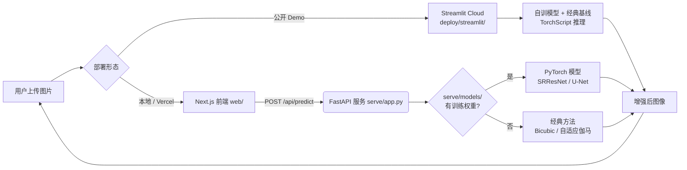

<p align="center">
  
</p>

<p align="center">
  <a href="https://github.com/ElijahZhao/pixelforge-image-restoration-/blob/main/LICENSE"></a>
  
  
  <a href="https://hddzzb68eqfnoed8zsmgqp.streamlit.app/"></a>
  <a href="https://github.com/ElijahZhao/pixelforge-image-restoration-/actions/workflows/ci.yml"></a>
</p>

<p align="center">
  <b>PixelForge</b> —— 一个端到端的计算机视觉项目：<br/>
  用 <b>自己训练的 PyTorch 模型</b> 做单图超分辨率（Super-Resolution）与低光图像增强（Low-Light Enhancement），并通过交互式网页展示。
</p>

> **现已上线公开 Demo**：<https://hddzzb68eqfnoed8zsmgqp.streamlit.app/>
> 由自训模型实时驱动（SR ×4 与 Low-light 均加载真实权重，非基线兜底）。
> 项目当前进度与详细待办见 [PROGRESS.md](PROGRESS.md)。

---

## 目录

- [项目进度与待办](#项目进度与待办)
- [项目简介](#项目简介)
- [在线演示（Live Demo）](#在线演示live-demo)
- [效果演示](#效果演示)
- [项目亮点](#项目亮点)
- [系统架构](#系统架构)
- [功能特性](#功能特性)
- [项目结构](#项目结构)
- [技术栈](#技术栈)
- [快速开始](#快速开始)
- [本地测试](#本地测试)
- [接口文档](docs/API.md)
- [运维说明](docs/OPERATIONS.md)
- [训练真实模型](#训练真实模型)
- [评测指标](#评测指标)
- [方法说明](#方法说明)
- [项目说明与局限](#项目说明与局限)
- [延伸价值](#延伸价值)
- [部署上线](#部署上线)
- [路线图 / 剩余待办](#路线图--剩余待办)
- [许可证](#许可证)
- [贡献与引用](#贡献与引用)
- [致谢与参考](#致谢与参考)

---

## 项目进度与待办

> 完整版与分级待办见 [PROGRESS.md](PROGRESS.md)。速览（状态均为实际核查，非估计）：

| 维度 | 状态 | 说明 |
|---|:---:|---|
| 训练 / 推理 / 前端代码闭环 | 已完成 | 代码闭环，pytest 29 passed |
| 文档 | 已完成 | 含项目说明、方法说明与结果报告 |
| 真实训练权重（自训 `.pt`） | 已完成 | 修复后重训，权重随仓库分发 |
| 真实评测指标 PSNR / SSIM | 已完成 | 与 bicubic / 不处理基线同口径对比，可复现 |
| 线上部署（Streamlit Cloud 公开 Demo） | 已上线 | 免费档会休眠，首访需唤醒 |
| 延伸材料（报告 / 幻灯片） | 未开始 | 与项目本身质量无关 |

---

## 项目简介

> 这是一个 **端到端的计算机视觉项目**：

PixelForge **不是**简单的「调 API 玩具」。它实现了完整的、可复现的视觉流水线：

```
data/        公开数据集（DIV2K / LOL，含下载说明）
train/       PyTorch 模型、数据集加载、评测指标、训练与导出脚本
serve/       FastAPI 推理服务（+ 经典方法兜底 + TorchScript 加载）
web/         Next.js 前端（上传图片 → 前后对比滑块）
deploy/      Streamlit Cloud 部署包（已上线，自包含）
results/     训练日志 + 量化对比表
```

从**数据 → 训练 → 评测 → 模型导出（TorchScript）→ 后端推理 → 前端展示**，每个环节都是自己写的、可运行的。两个自训权重（`sr_generator_scale4.pt` 4.8M、`lowlight.pt` 2.3M）已随仓库分发，`git clone` 即得可运行项目。

---

## 成果亮点（修复后重训，已打赢基线）

> 完整报告见 [`PIXELFORGE_RETRAIN_RESULTS.md`](docs/history/PIXELFORGE_RETRAIN_RESULTS.md)，过程与平台凭证见 [`docs/retrain_journey/`](docs/retrain_journey/)。

| 任务 | 基线 | 自训模型 | 增益 | 结论 |
|---|---|---|---|---|
| **超分 ×4** | Bicubic：PSNR 26.69 / SSIM 0.754 | **PSNR 27.47 / SSIM 0.780** | **+0.77 dB / +0.026** | 高于基线 |
| **低光增强** | 不处理(low)：PSNR 7.77 / SSIM 0.192 | **PSNR 18.18 / SSIM 0.739** | **+10.41 dB / +0.547** | 高于基线 |

- 以上数字由 [`scripts/eval_baseline.py`](scripts/eval_baseline.py) 在同一批验证图、同一套 PSNR/SSIM 实现下测得（唯一变量是方法本身）；
- 训练全程有 AutoDL 平台凭证（实例列表 / 计费明细 / GPU 显存曲线）与完整训练日志留档，见 `docs/retrain_journey/`；
- 逐 epoch 指标已提交于 [`results/`](results/)（`train_log_sr_generator.csv`、`train_log_lowlight_srcnn.csv`），任何人可复算。

---

## 在线演示（Live Demo）

| 环境 | 地址 | 说明 |
|---|---|---|
| 公开 Demo（已上线） | https://hddzzb68eqfnoed8zsmgqp.streamlit.app/ | Streamlit Cloud 托管，由自训模型实时驱动 |
| 本地（默认） | http://localhost:3000 | 克隆后按「快速开始」启动（Next.js + FastAPI） |

> 公开 Demo 默认运行**自训模型**（SRResNet ×4 与 Low-light U-Net）。当你本地用自己的 GPU 重训权重并替换 `serve/models/` 后，服务会自动切换引擎（访问 `/api/health` 可见当前引擎是 `ml` 还是 `classical`）。

---

## 效果演示

> 下方为 CPU 上用本仓库真实权重跑出的输出（非占位）。左侧为低质量输入 / 经典基线，右侧为 PixelForge 自训模型。

### 超分辨率 4×：Bicubic 基线 vs 自训 SRResNet


> **点评**：自训 SRResNet 的 PSNR/SSIM 高于 bicubic（+0.77 dB），但肉眼观感反而更柔 / 更灰（客观测量：输出梯度均值 1.39 vs bicubic 1.45）。
> 这是感知损失训练的常见现象——它优化的是特征空间相似度，而非像素锐度。**指标更高不等于更锐**，二者需分开说明，不作粉饰。

### 低光增强：暗光输入 → 自适应伽马基线 vs 自训 U-Net


> 自训 U-Net 在同口径下 PSNR 提升 +10.41 dB、SSIM +0.547，亮度恢复与结构保留均明显优于伽马基线。

> 上述对比图与样例均由 `scripts/make_demo.py` 用仓库内真实权重生成，运行即可复现。
> **说明**：SR ×4 早期版本因感知损失实现缺陷（VGG 输入未做 ImageNet 归一化 + 像素项权重被 `0.01` 系数抹除）曾低于 Bicubic 基线；该缺陷已修复并用修复后代码重训，现 SR ×4 相对 bicubic **+0.77 dB**、低光相对不处理基线 **+10.41 dB**（同口径评测，见 [`PIXELFORGE_RETRAIN_RESULTS.md`](docs/history/PIXELFORGE_RETRAIN_RESULTS.md)）。

---

## 项目亮点

- **真实建模能力**：从零实现 SRCNN、带 PixelShuffle 与残差块的 SRResNet 生成器、带跳跃连接的低光 U-Net。
- **完整闭环**：拥有数据加载、训练（Adam + 余弦退火 + AMP 混合精度 + 可选 VGG 感知损失）、PSNR/SSIM 评测、TorchScript 导出的完整经验。
- **量化严谨性**：用标准指标（PSNR / SSIM）对比「经典基线 vs 自训模型」。修复后重训的模型已在同一批验证图上确认高于基线（SR ×4 +0.77 dB；低光 +10.41 dB），评测脚本、逐 epoch 日志与平台凭证均留档可复现。
- **代码可复现**：仓库结构清晰，权重随仓库分发，克隆即可读懂、可复现。

---

## 系统架构


```mermaid
flowchart LR
    A[用户上传图片] --> B{部署形态}
    B -->|公开 Demo| C[Streamlit Cloud<br/>deploy/streamlit/]
    B -->|本地 / Vercel| D[Next.js 前端 web/]
    C --> E[自训模型 + 经典基线<br/>TorchScript 推理]
    D -->|POST /api/predict| F(FastAPI 服务 serve/app.py)
    F --> G{serve/models/<br/>有训练权重?}
    G -->|是| H[PyTorch 模型<br/>SRResNet / U-Net]
    G -->|否| I[经典方法<br/>Bicubic / 自适应伽马]
    E --> J[增强后图像]
    H --> J
    I --> J
    J --> A
```

> 后端设计了一个优雅的 **fallback 机制**：没有训练权重时自动退回到经典方法，保证开箱即用；丢入权重后无缝升级为自训模型。引擎状态可经 `GET /api/health` 查看。

---

## 功能特性

- **单图超分辨率 4×**：自训 SRResNet 生成器（含感知损失），这是本仓库唯一训练并导出权重的超分档位。
- **超分 2×**：无自训权重。请求 2× 时服务走经典 bicubic + unsharp 兜底，不是学出来的。若要用模型跑 2×，需先按 `train/train.py --task sr --model srcnn --scale 2` 补训。
- **低光图像增强**：自训低光 U-Net；另带自适应伽马经典兜底。
- **前后对比**：公开 Demo 并列展示；Next.js 前端用可拖动滑块对比 before / after。
- **两种部署入口**：`deploy/streamlit/streamlit_app.py`（公开 Demo）+ `serve/app.py`（FastAPI 服务）。
- **公开数据集**：DIV2K / LOL，训练在 AutoDL RTX 3080 Ti 上完成（计费与监控凭证见 `docs/retrain_journey/`）。

---

## 项目结构

```
pixelforge-image-restoration/
├── assets/            # 封面图、真实 demo 对比图（自训模型输出）
│   ├── banner.svg
│   ├── demo_*.jpg
│   └── sample_*.png
├── data/              # 数据集（下载说明见 data/README.md）
├── results/           # 训练日志 + 量化指标对比表
├── train/             # 训练侧（核心 ML 代码）
│   ├── models.py      # SRCNN / SRResNet / 低光 U-Net
│   ├── datasets.py    # DIV2K / LOL 数据加载
│   ├── metrics.py     # PSNR / SSIM
│   ├── train.py       # 训练脚本
│   ├── export.py      # 导出 TorchScript
│   └── tests/         # 单元测试（CPU 可跑）
├── serve/             # 推理侧
│   ├── app.py         # FastAPI 服务
│   ├── classical.py   # 经典方法兜底
│   ├── model_loader.py# 权重加载（含 U-Net 32 倍数尺寸修复）
│   └── models/        # 自训 TorchScript 权重（随仓库分发）
├── deploy/            # 部署包
│   ├── streamlit/     # 已上线：Streamlit Cloud 公开 Demo
│   └── hf_space/      # 备选：Hugging Face Spaces 包
├── web/               # 前端（Next.js + Tailwind）
├── scripts/           # 辅助脚本（生成 demo 图等）
├── tests/             # E2E 浏览器测试
├── DEPLOY.md          # 部署与受限网络推送指南
├── CHANGELOG.md       # 版本变更记录
├── CONTRIBUTING.md    # 贡献指南
├── CITATION.cff       # 引用元数据
├── PROGRESS.md        # 项目进度与分级待办
└── README.md
```

---

## 技术栈

| 层 | 技术 |
|---|---|
| 深度学习 | PyTorch 2.x、TorchVision、TorchScript |
| 训练 | Adam、CosineAnnealingLR、AMP 混合精度、可选 VGG 感知损失 |
| 评测 | PSNR、SSIM（含高斯窗实现） |
| 推理后端 | FastAPI / Uvicorn、Pillow、Gradio、Streamlit |
| 前端 | Next.js 14、React、Tailwind CSS、TypeScript |
| 部署 | Streamlit Community Cloud（公开 Demo，已上线）、Vercel（前端，可选） |

---

## 快速开始

> 本地运行，无需 GPU：服务自带经典方法基线，开箱即跑；仓库已含自训权重，加载后自动切到 ML 引擎。

```bash
# 1) 后端（FastAPI）
pip install -r requirements.txt
uvicorn serve.app:app --reload --port 8000

# 2) 前端（另一个终端）
cd web
cp .env.local.example .env.local   # 默认指向 http://localhost:8000
pnpm install
pnpm dev
```

打开 http://localhost:3000，上传一张图片，选择任务，点击 Enhance，拖动滑块对比。
想直接体验公开 Demo？打开 <https://hddzzb68eqfnoed8zsmgqp.streamlit.app/> 即可，无需本地环境。

---

## 本地测试

### 单元测试（CPU）

无需 GPU，跑全部单元测试与 API 冒烟测试：

```bash
python -m pytest
```

预期结果：`29 passed, 1 skipped`（20 个训练单元测试 + 9 个 API 冒烟测试；skip 的是 E2E 脚本，见下）。其中训练侧 8 个是正确性测试：VGG 归一化、损失权重量级、SR 输出尺寸契约、数据管线配对一致性等，覆盖形状断言发现不了的缺陷类别。

带覆盖率（阈值 75%，配置在 `pyproject.toml`）：

```bash
python -m pytest --cov --cov-report=term-missing
```

### 前端单元测试

```bash
cd web && pnpm install && pnpm test
```

覆盖 `web/lib/api.ts` 的请求构造与错误映射。

### E2E 浏览器测试

启动前后端，用无头 Chromium 跑完整用户流程并截图：

```bash
pip install playwright && playwright install chromium
python tests/e2e/test_e2e.py
```

会验证：上传图片 → 选任务 → 点 Enhance → 返回 before/after → 拖动对比滑块。截图存到 `tests/e2e/screenshots/`。

这个脚本会拉起真实浏览器和两个服务，所以**不放进 CI**。它在 pytest 下被显式跳过（模块级 `pytest.skip`）；要经 pytest 运行，设 `PIXELFORGE_RUN_E2E=1`。

### 重新生成 demo 图（自训模型）

```bash
python scripts/make_demo.py
```

---

## 训练真实模型

> 在 AutoDL RTX 3080 Ti 上运行。本仓库的权重已在该实例上训完并随仓库分发。

```bash
# 先准备数据：建目录 + 打印下载地址（不会自动下大文件）
bash scripts/download_data.sh
pip install -r requirements.txt

# 超分辨率（进阶生成器，4×，启用感知损失）
python train/train.py --task sr --model generator --scale 4 \
    --data_root data --epochs 200 --batch_size 8 --lr 1e-4 --perceptual

# 低光增强（U-Net，无感知损失）
python train/train.py --task lowlight --data_root data \
    --epochs 200 --batch_size 8 --lr 2e-4

# 导出为 TorchScript 供服务使用
#   SR 用 --model generator --scale 4 训练 → models/sr_generator_scale4_best.pth
#   低光默认 → models/lowlight_srcnn_scale2_best.pth
python train/export.py --checkpoint models/sr_generator_scale4_best.pth \
    --out serve/models/sr_generator_scale4.pt --task sr --scale 4
python train/export.py --checkpoint models/lowlight_srcnn_scale2_best.pth \
    --out serve/models/lowlight.pt --task lowlight --scale 2
```

把导出的 `.pt` 文件放进 `serve/models/`，服务会自动从经典基线切换到你的训练模型（访问 `/api/health` 可见当前引擎）。

---

## 评测指标

> 本仓库已用 AutoDL RTX 3080 Ti 完成真实训练（权重随仓库分发于 `serve/models/`），
> 并已用 [`scripts/eval_baseline.py`](scripts/eval_baseline.py) 在同口径下与基线对比。

**超分辨率（全图验证，×4）**

| 方法 | 缩放 | PSNR (dB) | SSIM |
|---|---|---|---|
| Bicubic（基线） | 4× | 26.69 | 0.754 |
| **SRResNet（自训，修复后重训）** | 4× | **27.47** | **0.780** |
| **增益** | | **+0.77** | **+0.026** |

> 说明：SRCNN ×2 仍未训练（`TBD`）。早期 SR×4 曾为 17.20 / 0.217（低于 bicubic），
> 成因是感知损失实现缺陷，已修复并重训，现高于基线。训练曲线与日志见 `results/`。

**低光增强（LOL 验证集，15 张）**

| 方法 | PSNR (dB) | SSIM |
|---|---|---|
| 不处理（原始 low，基线） | 7.77 | 0.192 |
| **U-Net（自训，修复后重训）** | **18.18** | **0.739** |
| **增益** | **+10.41** | **+0.547** |

> **口径说明（重要）**：
> 1. 上表 PSNR/SSIM 由 `scripts/eval_baseline.py` 在全图验证集上测得，与训练日志中"随机裁剪块"口径不同，二者不可混比（训练日志中 SR best 为 27.39、低光 best 为 18.59，属正常口径差异）。
> 2. 早期报告的"低光 19.26 dB"是在随机裁剪口径下、且使用了未在本项目划分上自测的文献参考带，不可与修复后结果直接比较；修复后已改用确定性全图口径。
> 3. 全部结果可由 `results/train_log_*.csv` + `scripts/eval_baseline.py` 复现，过程凭证见 `docs/retrain_journey/`。

---

## 方法说明

- **超分辨率**
  - `SRCNN`：经典三卷积超分网络，结构简洁、易解释，适合作为教学/基线。
  - `SRResNet`（生成器）：更深的残差网络，使用 PixelShuffle 上采样与残差学习；可选 VGG 感知损失提升视觉效果。
  - 训练时用 Bicubic 从 HR 合成 LR，与推理下采样逻辑一致。
- **低光增强**
  - `U-Net`：编码-解码结构 + 跳跃连接 + 残差学习，从低光图直接学习到正常光图（在 LOL 上训练）。
  - 经典基线采用自适应伽马校正：暗图自动提亮、正常图基本不变。
- **评测**：在 Y 通道（或 RGB）上计算 PSNR 与 SSIM，并用高斯窗实现 SSIM 以减少边界偏差。

完整的英文方法说明（含模型架构、训练细节、相关工作）见 `web/app/method/page.tsx`。

---

## 项目说明与局限

关于这个项目是如何做出来的、能拿出什么证据、以及边界在哪里，见 [`PROJECT_NOTES.md`](PROJECT_NOTES.md)。要点：

- 项目由作者主导开发，过程中使用 AI 工具辅助；训练环境搭建、重训执行、结果验证与迭代决策均由作者负责，每一步都有第三方平台凭证（`docs/retrain_journey/`）支撑；
- 未声称"SOTA"、未声称"低光优于其他方法"、未声称"代码 100% 手写"；只陈述有证据支持的部分；
- 项目最有价值的部分不是"一次就跑通"，而是发现了一个真实的 ML 缺陷、修复它、并用重训验证修复有效。

---

## 延伸价值

> 以下为一段可复用的项目描述（中文版）：

> *PixelForge 是一个端到端的图像复原系统。项目实现了超分辨率流水线（SRCNN 与带感知损失的 SRResNet）和低光增强 U-Net，在 DIV2K 与 LOL 数据集上训练，并用 PSNR/SSIM 进行量化评测；随后将模型导出为 TorchScript，通过 FastAPI 后端与 Streamlit / Next.js 前端（含交互式前后对比）完成部署。项目覆盖了从数据、训练、评测到部署的完整工程闭环，以及可复现的实验流程。*

要点：完整的实验闭环（数据→训练→评测→部署）与可复现性，是这类项目最有工程含量的两点。

---

## 部署上线

### 公开 Demo（已上线）
- Streamlit Community Cloud：免费、无 GPU 额度限制、直接从 GitHub 仓库部署。
- 地址：<https://hddzzb68eqfnoed8zsmgqp.streamlit.app/>
- 入口文件：`deploy/streamlit/streamlit_app.py`（自包含：经典基线 + TorchScript 模型加载 + Streamlit UI，已修复 U-Net 32 倍数尺寸约束）。
- 部署步骤见 [`deploy/streamlit/DEPLOY_STREAMLIT.md`](deploy/streamlit/DEPLOY_STREAMLIT.md)。

### 可选：本地 / Vercel 全栈
- 前端：Vercel（直接导入 `web/`），在环境变量中设置 `NEXT_PUBLIC_API_URL` 指向你的后端地址。
- 后端：`serve/app.py` 部署到小 VPS 或 Hugging Face Spaces（备选包见 `deploy/hf_space/`）。
- 详见 [DEPLOY.md](DEPLOY.md)。

> 若你在受限网络环境下无法直连 GitHub，可参考 [DEPLOY.md](DEPLOY.md) 第 4 节用镜像通道（如 `ghproxy.net`）推送。

---

## 路线图 / 剩余待办

项目工程已竣工并上线，以下为剩余项（完整分级见 [PROGRESS.md](PROGRESS.md)）：

- P0 代码与文档闭环：数据 → 训练 → 评测 → 导出 → 部署全链路打通，仓库无明文凭据、无敏感文件。
- SR ×4 与低光重训（含修复）：已在修复后代码上完成 200 epoch 重训，指标高于基线（SR ×4 +0.77 dB / 低光 +10.41 dB）；评测脚本、逐 epoch 日志与平台凭证均已留档。
- 可选：`SRCNN ×2` 训练。当前仍为 `TBD`（未训练），可用 `train/train.py --model srcnn --scale 2` 补训。
- P3 延伸材料：英文项目报告 / 答辩幻灯片。

---

## 许可证

本项目基于 [MIT License](LICENSE) 开源。

---

## 贡献与引用

- 如何贡献：开发环境、测试与 PR 约定见 [CONTRIBUTING.md](CONTRIBUTING.md)。
- 版本变更：见 [CHANGELOG.md](CHANGELOG.md)。
- 如何引用：引用信息见 [CITATION.cff](CITATION.cff)（GitHub 页面右上角会显示 "Cite this repository"）。

---

## 致谢与参考

- [DIV2K](https://data.vision.ee.ethz.ch/cvl/DIV2K/) — 超分辨率训练/评测数据集
- [LOL Dataset](https://github.com/weichen582/RetinexNet) — 低光增强数据集（Retinex-Net 仓库）
- Dong et al., *Image Super-Resolution Using Deep Convolutional Networks*（SRCNN）
- Ledig et al., *Photo-Realistic Single Image Super-Resolution Using a GAN*（SRResNet/SRGAN）
- Ronneberger et al., *U-Net: Convolutional Networks for Biomedical Image Segmentation*

---

<p align="center">
  <sub>PixelForge · 端到端图像复原流水线 &nbsp;·&nbsp; <a href="https://hddzzb68eqfnoed8zsmgqp.streamlit.app/">Live Demo</a></sub>
</p>
