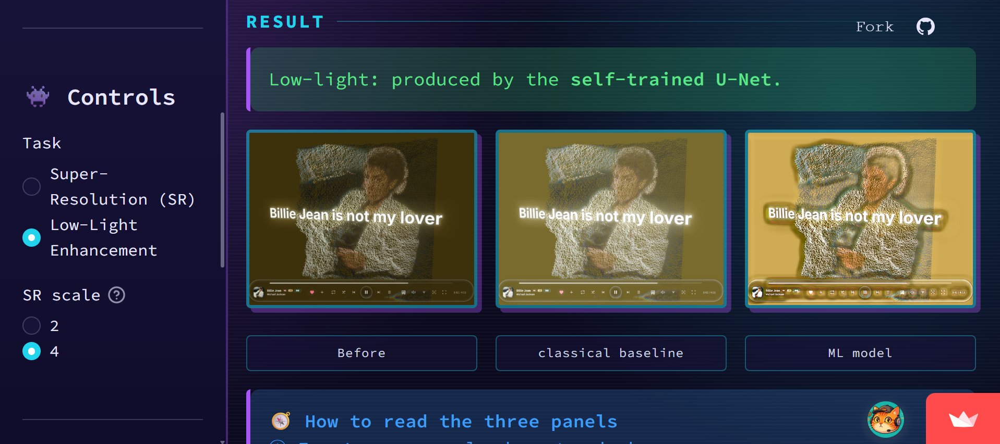
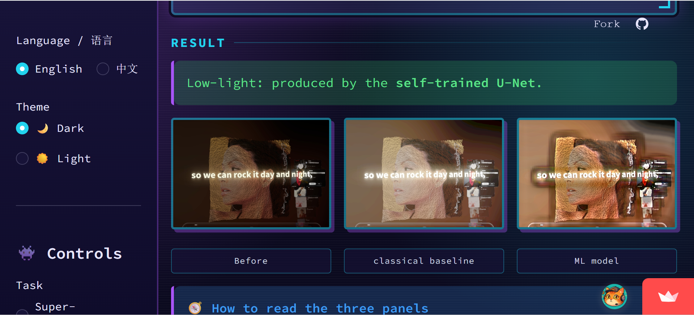
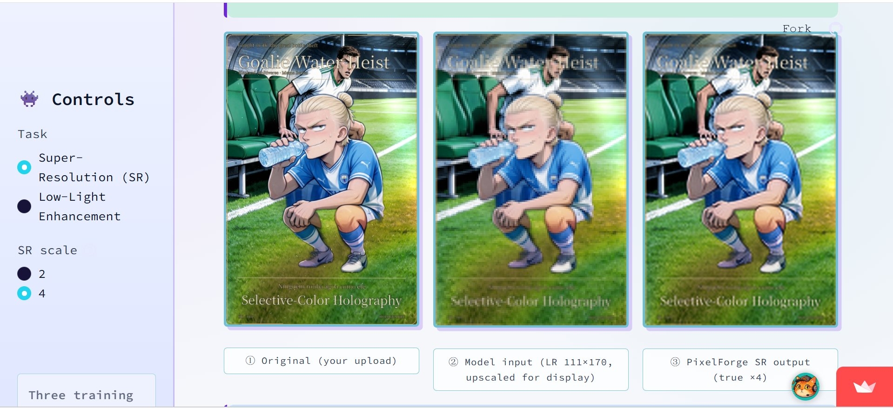
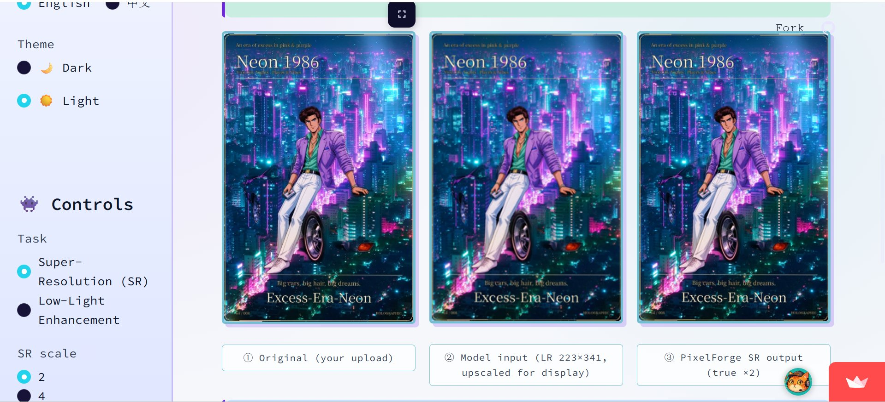
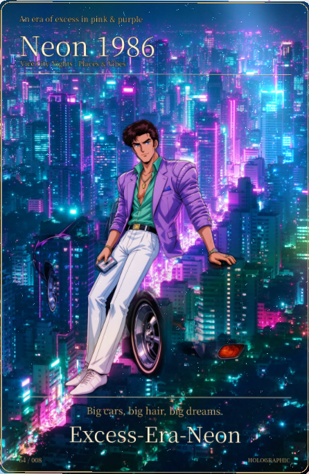
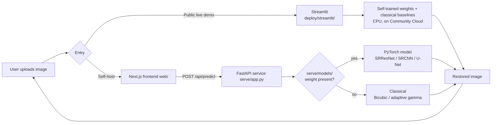

<p align="center">
  
</p>

<p align="center">
  <a href="https://pixelforge-image-restoration.streamlit.app/"></a>
  
  
  <a href="https://github.com/ElijahZhao/pixelforge-image-restoration-/actions/workflows/ci.yml"></a>
  <a href="LICENSE"></a>
</p>

<p align="center">
  <b>PixelForge</b>: an end-to-end image restoration pipeline<br/>
  Self-trained PyTorch models for single-image super-resolution and low-light enhancement,
  built end to end from data to training, evaluation and deployment.
</p>

<p align="center">
  <a href="https://pixelforge-image-restoration.streamlit.app/"><b>Live demo</b></a> &nbsp;·&nbsp;
  <a href="#-quick-start">Quick start</a> &nbsp;·&nbsp;
  <a href="#-results">Results</a> &nbsp;·&nbsp;
  <a href="README.zh-CN.md">中文</a>
</p>

---

## 🎯 What it is

PixelForge implements a **complete, reproducible** vision pipeline rather than a wrapper around an API:

```
data → training → evaluation → export (TorchScript) → backend inference → frontend
```

Every stage is written from scratch and runnable. **Three** self-trained weights
(`sr_generator_scale4.pt`, `sr_generator_scale2.pt`, `lowlight.pt`) ship with the repo, so a
clone runs out of the box — no GPU needed for the demo or the tests.

## ✨ Highlights

- **Real modelling**: SRCNN, an SRResNet generator with PixelShuffle + residual blocks, and a low-light U-Net with skip connections, all written from scratch.
- **Full training loop**: data loading, Adam + cosine annealing + AMP mixed precision + optional VGG perceptual loss, PSNR/SSIM evaluation, TorchScript export.
- **Three shipped weights**: SR ×4 (PSNR 27.47), SR ×2 (PSNR 32.35) and low-light (PSNR 18.32) — each beats its classical baseline; classical methods remain as automatic fallback if a weight is ever missing.
- **Quantitative comparison**: classical baselines vs. self-trained models on the same validation set; scripts and per-epoch logs are committed and recomputable.
- Production hygiene is not an afterthought: CI (tests + coverage gate + dependency audit + frontend build), a non-root Docker image, per-IP rate limiting, and API docs.

## 🖼️ Showcase

> Outputs below are produced on CPU with the repo's real weights. The first two are side-by-side comparisons (left: low-quality input / classical baseline, right: PixelForge self-trained model); the last three are screenshots of the public demo running live, one per task.

**Super-resolution ×4: Bicubic baseline vs. self-trained SRResNet**


> The self-trained SRResNet scores higher PSNR/SSIM than bicubic (+0.77 dB) but looks softer / greyer (measured: output gradient mean 1.39 vs. 1.45 for bicubic). This is typical of perceptual-loss training: it optimises feature-space similarity, not pixel sharpness. The metric and the visual result point in different directions.

**Low-light enhancement: dark input → adaptive-gamma baseline vs. self-trained U-Net**


> The self-trained U-Net gains +10.55 dB PSNR and +0.553 SSIM on the same caliber, clearly ahead of the gamma baseline in both brightness recovery and structure retention.

> Comparison figures are generated by `scripts/make_demo.py` + `scripts/make_compare.py` from the repo's real weights; run them to reproduce.

**Running live** — the public demo, low-light task on real photos. Left to right: your input, the classical adaptive-gamma baseline, the self-trained U-Net. The service picked the ML engine and ran the real weights on CPU. Shown in the demo's dark theme.





> The demo is at <https://pixelforge-image-restoration.streamlit.app/>. It ships a bilingual UI, a dark/light theme toggle, and the three-panel view above so the low-res input the model actually sees is visible, not hidden.

**Running live, super-resolution ×4** — same demo, light theme. Left to right: your upload, the model input (LR 111×170, upscaled for display), and the true ×4 output from the self-trained SRResNet. The sidebar keeps the training provenance on display.



**Running live, super-resolution ×2** — the ×2 slot runs its own self-trained SRCNN (PSNR 32.35 vs. bicubic 31.04 on the same caliber). Demo view, then the full ×2 case as three separate downloads the demo exposes: the original upload, the model input (LR 223×341), and the ×2 output (446×682).



| Original upload (446×683) | Model input (LR 223×341) | PixelForge ×2 output (446×682) |
|:---:|:---:|:---:|
|  |  |  |

## 📊 Results

> Numbers are measured by [`scripts/eval_baseline.py`](scripts/eval_baseline.py) on the same validation set with the same PSNR/SSIM implementation, so the only variable is the method. Per-epoch logs are under [`results/`](results/).

| Task | Baseline | Ours | Gain |
|---|---|---|---|
| **Super-resolution ×4** | Bicubic: PSNR 26.69 / SSIM 0.754 | **PSNR 27.47 / SSIM 0.780** | **+0.77 dB / +0.026** |
| **Super-resolution ×2** | Bicubic: PSNR 31.04 / SSIM 0.894 | **PSNR 32.35 / SSIM 0.917** | **+1.31 dB / +0.023** |
| **Low-light enhancement** | No-op: PSNR 7.77 / SSIM 0.192 | **PSNR 18.32 / SSIM 0.746** | **+10.55 dB / +0.553** |

**Note on methodology**: all three rows are measured on the full-image validation set under the same protocol, which is also the protocol used to select the deployed weights. The per-epoch training logs under `results/` use a different (random-crop) protocol and are **not** directly comparable — see [`results/README.md`](results/README.md) for the full explanation and the exact commands to reproduce every number.

What this does **not** claim: SOTA. SR ×4 at 27.47 dB beats the bicubic baseline but is below
large-dataset academic SOTA (30+ dB) — the training set and model capacity are small. The
low-light gain is relative to a no-op baseline, not to other published methods.

## 🚀 Quick start

> The public demo needs no install. Locally, everything runs on CPU — classical baselines work out of the box, and the shipped weights switch the demo to the ML engine automatically.

**A. Public demo (no install)**

Open <https://pixelforge-image-restoration.streamlit.app/>. The free tier sleeps, so the first
visit may need a few seconds to wake up.

**B. Run the same demo locally**

```bash
pip install -r deploy/streamlit/requirements.txt   # CPU-only torch, pinned for the free tier
streamlit run deploy/streamlit/streamlit_app.py
```

**C. Self-host the FastAPI backend + Next.js frontend**

```bash
# Backend
pip install -r requirements.txt          # torch is NOT pinned here — install it separately:
pip install torch torchvision            # CPU build for dev; use the CUDA build on a GPU box
uvicorn serve.app:app --reload --port 8000

# Frontend (separate terminal)
cd web
cp .env.local.example .env.local         # points to http://localhost:8000 by default
pnpm install
pnpm dev
```

Open http://localhost:3000, upload an image, pick a task, hit **Enhance**, drag the slider.

**Docker** (backend only)

```bash
docker build -t pixelforge-serve .
docker run -p 8000:8000 pixelforge-serve
```

The image bundles the trained weights and starts in ML mode. The frontend is a separate build
target and is not part of this image.

## 🏗️ Architecture


```mermaid
flowchart LR
    A[User uploads image] --> B{Entry}
    B -->|Public live demo| C[Streamlit<br/>deploy/streamlit/]
    B -->|Self-host| D[Next.js frontend web/]
    C --> E[Self-trained weights + classical baselines<br/>CPU, on Community Cloud]
    D -->|POST /api/predict| F(FastAPI service serve/app.py)
    F --> G{serve/models/<br/>weight present?}
    G -->|yes| H[PyTorch model<br/>SRResNet / SRCNN / U-Net]
    G -->|no| I[Classical<br/>Bicubic / adaptive gamma]
    E --> J[Restored image]
    H --> J
    I --> J
    J --> A
```

The public demo is the Streamlit app (`deploy/streamlit/streamlit_app.py`) running on Community
Cloud — that is the live, deployed artifact. The FastAPI backend (`serve/app.py`) and the Next.js
frontend (`web/`) are part of the same codebase and can be self-hosted; `web/` posts to
`serve/app.py`, which picks the ML engine for a task/scale when a weight is loaded, otherwise a
classical baseline. `GET /api/health` reports which engine each slot is using. Full interface in
[`docs/API.md`](docs/API.md).

## 🧩 Features

- **SR ×4**: self-trained SRResNet generator with perceptual loss. PSNR 27.47 / SSIM 0.780 vs. bicubic.
- **SR ×2**: self-trained SRCNN, PSNR 32.35 / SSIM 0.917 vs. bicubic — no longer a classical fallback.
- **Low-light enhancement**: self-trained low-light U-Net (PSNR 18.32 / SSIM 0.746), plus an adaptive-gamma classical fallback and an exposure gate for inputs that are dark but not underexposed photos.
- **Before/after**: side-by-side in the Streamlit demo; draggable slider in the Next.js frontend.
- **Three trained weights ship** in `serve/models/` (and a copy in `deploy/streamlit/models/` for the demo); classical baselines remain as automatic fallback if a weight is ever missing.

## 🧪 Tests

```bash
# unit + API smoke + real-weight integration tests (CPU-friendly)
python -m pytest

# with coverage (gate 75%, configured in pyproject.toml)
python -m pytest --cov --cov-report=term-missing

# frontend unit tests + type-check
cd web && pnpm install && pnpm test
cd web && pnpm exec tsc --noEmit
```

Expected: `39 passed, 1 skipped` (27 training unit tests + 9 API smoke tests + 3 real-weight
integration tests; the skip is the E2E script). The integration tests load the real weights
under `serve/models/` through the full inference path, confirming the ML engine actually serves
rather than silently degrading to the classical baseline.

The E2E browser test (`tests/e2e/test_e2e.py`) drives a real Chromium through the full upload
flow. It boots two servers and a browser, so it is skipped under pytest by default; run it
directly, or set `PIXELFORGE_RUN_E2E=1`.

CI (`.github/workflows/ci.yml`) runs three jobs: pytest with a coverage gate, `pip-audit` over
the lock file, and the frontend type-check + tests + build.

## 🧰 Training

Requires a GPU. Prepare data first (builds directories and prints download URLs; does not fetch
the multi-GB datasets):

```bash
bash scripts/download_data.sh

# Super-resolution (4×, with perceptual loss)
python train/train.py --task sr --model generator --scale 4 \
    --data_root data --epochs 200 --batch_size 8 --lr 1e-4 --perceptual

# Super-resolution (2×, SRCNN)
python train/train.py --task sr --model srcnn --scale 2 \
    --data_root data --epochs 200 --batch_size 8 --lr 1e-4

# Low-light (U-Net)
python train/train.py --task lowlight --data_root data \
    --epochs 200 --batch_size 8 --lr 2e-4

# Export to TorchScript for the service / demo
python train/export.py --checkpoint models/sr_generator_scale4_best.pth \
    --out serve/models/sr_generator_scale4.pt --task sr --scale 4
python train/export.py --checkpoint models/sr_generator_scale2_best.pth \
    --out serve/models/sr_generator_scale2.pt --task sr --scale 2
python train/export.py --checkpoint models/lowlight_srcnn_scale2_best.pth \
    --out serve/models/lowlight.pt --task lowlight --scale 2
```

Drop the exported `.pt` files into `serve/models/` (and `deploy/streamlit/models/` for the demo)
and the service picks them up on restart.

## 🔬 Method

- **Super-resolution**
  - `SRCNN`: classic three-conv SR network, simple and interpretable as a baseline.
  - `SRResNet` (generator): deeper residual network with PixelShuffle upsampling and residual learning, optional VGG perceptual loss.
  - LR is synthesised from HR by bicubic downscaling during training, matching the inference downsampling.
- **Low-light enhancement**
  - `U-Net`: encoder-decoder with skip connections and residual learning, mapping low-light to normal-light (trained on LOL).
  - Classical baseline uses adaptive gamma: dark images brighten, already-lit images stay put.
- **Evaluation**: PSNR and SSIM on the Y channel (or RGB), with a Gaussian-window SSIM to reduce boundary bias.

A longer write-up of the architectures, training details and related work lives at `web/app/method/page.tsx` and renders at `/method` on the site.

## 📁 Structure

```
pixelforge-image-restoration/
├── assets/            # banner, real demo comparison figures
├── data/              # datasets (download notes; data itself not committed)
├── results/           # training logs + quantitative comparison
├── train/             # training-side core code
│   ├── models.py      # SRCNN / SRResNet / low-light U-Net
│   ├── datasets.py    # DIV2K / LOL loaders
│   ├── metrics.py     # PSNR / SSIM
│   ├── train.py       # training script
│   ├── export.py      # TorchScript export
│   └── tests/         # unit tests (CPU-friendly)
├── serve/             # inference side (FastAPI)
│   ├── app.py         # FastAPI service (rate limiting + resource guards)
│   ├── classical.py   # classical fallbacks
│   ├── model_loader.py# weight loading + U-Net size adaptation
│   └── models/        # self-trained TorchScript weights (committed)
├── deploy/            # streamlit/ (live demo)
├── web/               # frontend (Next.js + Tailwind)
├── scripts/           # helpers (demo figures, evaluation, data setup)
├── tests/             # API smoke + real-weight integration + E2E
├── docs/              # API.md (interface reference)
├── Dockerfile         # inference service image
├── DEPLOY.md          # deployment guide
├── CHANGELOG.md       # version history
├── CONTRIBUTING.md    # contribution guide
├── CITATION.cff       # citation metadata
└── README.zh-CN.md    # 中文 README
```

## 🛠️ Stack

| Layer | Tech |
|---|---|
| Deep learning | PyTorch 2.x, TorchVision, TorchScript |
| Training | Adam, CosineAnnealingLR, AMP mixed precision, optional VGG perceptual loss |
| Metrics | PSNR, SSIM (Gaussian-window implementation) |
| Backend | FastAPI / Uvicorn, Pillow |
| Frontend | Next.js 14, React 18, Tailwind CSS, TypeScript |
| Deploy | Streamlit Community Cloud (public demo), Docker, Vercel (optional) |

## ❓ FAQ

**Do I need a GPU?**
No. The public demo, the local demo, and the whole test suite run on CPU. Only (re)training needs a GPU.

**Which tasks have a trained weight?**
All three: SR ×4 (27.47 dB), SR ×2 (32.35 dB) and low-light (18.32 dB). Each beats its classical baseline. The classical methods stay as an automatic fallback if a weight file is ever missing.

**The SR ×4 result looks softer than bicubic — is it broken?**
No. SR ×4 uses a perceptual (VGG) loss, which optimises feature-space similarity rather than pixel sharpness; that is why it scores higher PSNR/SSIM yet looks a little softer. This is expected behaviour of perceptual-loss training, not a defect.

**The public demo is slow or shows a wake-up screen.**
The free Streamlit tier sleeps when idle; the first visit after a pause takes a few seconds to spin up. Inference itself runs on CPU and is normally quick for typical photos.

**Can I run it behind a restricted network?**
Yes — see [DEPLOY.md](DEPLOY.md) for pushing the image via a mirror when GitHub is not directly reachable.

## ☁️ Deployment

**Public demo (live)**: Streamlit Community Cloud deploys straight from the repo, entry
`deploy/streamlit/streamlit_app.py` (self-contained). Steps in
[`deploy/streamlit/DEPLOY_STREAMLIT.md`](deploy/streamlit/DEPLOY_STREAMLIT.md).

**Self-host**: the backend `serve/app.py` runs on a VPS; the frontend `web/` deploys to Vercel with
`NEXT_PUBLIC_API_URL` pointing at your backend. See [DEPLOY.md](DEPLOY.md).

## 🗺️ Roadmap

The engineering is complete and live; the remaining items are optional extensions:

- Extended materials: English project report / slides.
- (The ×2 SRCNN slot is already trained and shipped — no further work needed there.)

## 📝 Changelog

Full history in [CHANGELOG.md](CHANGELOG.md). Recent:

- **1.2.2** — Hardened the public-demo upload guard (reject decompression bombs before decode), dropped the unused Gradio dependency, and locked the CI coverage gate.
- **1.2.1** — New demo showcase assets and a fix for the demo's out-of-memory crash on large uploads.
- **1.2.0** — Shipped the first ×2 super-resolution weight and refreshed the low-light weight.

## 📄 License & citation

MIT — see [LICENSE](LICENSE). Contribution guide in [CONTRIBUTING.md](CONTRIBUTING.md),
version history in [CHANGELOG.md](CHANGELOG.md), citation info in [CITATION.cff](CITATION.cff).

## 🙏 Acknowledgements

- [DIV2K](https://data.vision.ee.ethz.ch/cvl/DIV2K/) — super-resolution dataset
- [LOL Dataset](https://github.com/weichen582/RetinexNet) — low-light dataset (Retinex-Net repo)
- Dong et al., *Image Super-Resolution Using Deep Convolutional Networks* (SRCNN)
- Ledig et al., *Photo-Realistic Single Image Super-Resolution Using a GAN* (SRResNet / SRGAN)
- Ronneberger et al., *U-Net: Convolutional Networks for Biomedical Image Segmentation*

---

<p align="center">
  <sub>PixelForge · end-to-end image restoration pipeline &nbsp;·&nbsp; <a href="https://pixelforge-image-restoration.streamlit.app/">Live Demo</a></sub>
</p>
