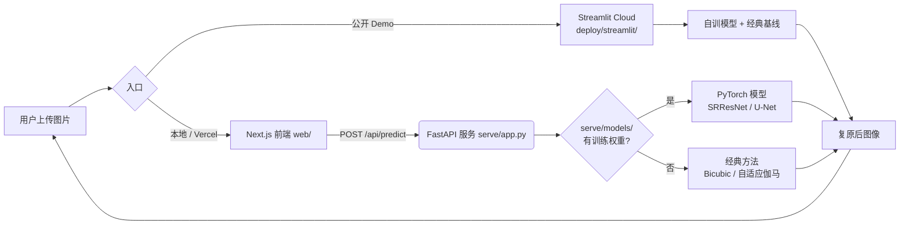

<p align="center">
  
</p>

<p align="center">
  <a href="https://pixelforge-image-restoration.streamlit.app/"></a>
  
  
  <a href="https://github.com/ElijahZhao/pixelforge-image-restoration-/actions/workflows/ci.yml"></a>
  <a href="LICENSE"></a>
</p>

<p align="center">
  <b>PixelForge</b>：端到端图像复原流水线<br/>
  用自训 PyTorch 模型做单图超分辨率与低光增强，从数据、训练、评测到部署全链路自建。
</p>

<p align="center">
  <a href="https://pixelforge-image-restoration.streamlit.app/"><b>在线体验</b></a> &nbsp;·&nbsp;
  <a href="#-快速开始">快速开始</a> &nbsp;·&nbsp;
  <a href="#-评测结果">评测结果</a> &nbsp;·&nbsp;
  <a href="README.md">English</a>
</p>

---

## 🎯 这是什么

PixelForge 实现了一条**完整、可复现**的视觉流水线，而不是调 API 的封装：

```
数据 → 训练 → 评测 → 模型导出（TorchScript）→ 后端推理 → 前端展示
```

每一环都是自己写的、能跑的。两个自训权重（`sr_generator_scale4.pt`、`lowlight.pt`）随仓库分发，克隆即可运行。
当前进度与分级待办见 [PROGRESS.md](PROGRESS.md)。

## ✨ 核心亮点

- **真实建模能力**：从零实现 SRCNN、带 PixelShuffle 与残差块的 SRResNet 生成器、带跳跃连接的低光 U-Net。
- **完整训练闭环**：数据加载、Adam + 余弦退火 + AMP 混合精度 + 可选 VGG 感知损失、PSNR/SSIM 评测、TorchScript 导出。
- **量化对比**：用标准指标在同一批验证图上对比「经典基线 vs 自训模型」，脚本与逐 epoch 日志均可复算。
- **优雅降级**：没有权重时自动走经典方法兜底，放上权重即切换 ML 引擎，`GET /api/health` 可查当前引擎。
- 工程细节也没落下：CI 三作业（测试 + 覆盖率 + 依赖审计 + 前端构建）、Docker 非 root 镜像、IP 限流、API 文档。

## 🖼️ 效果演示

> 下方为 CPU 上用本仓库真实权重跑出的输出。前两张为并排对比图（左：低质量输入 / 经典基线，右：PixelForge 自训模型），最后两张为公开 Demo 的线上实跑截图，每个任务各一张。

**超分辨率 4×：Bicubic 基线 vs 自训 SRResNet**


> 自训 SRResNet 的 PSNR/SSIM 高于 bicubic（+0.77 dB），但肉眼观感反而更柔、更灰（客观测量：输出梯度均值 1.39 vs bicubic 1.45）。这是感知损失训练的常见现象：它优化特征空间相似度，而非像素锐度。指标与观感在这里并不一致。

**低光增强：暗光输入 → 自适应伽马基线 vs 自训 U-Net**


> 自训 U-Net 在同口径下 PSNR 提升 +10.41 dB、SSIM +0.547，亮度恢复与结构保留均明显优于伽马基线。

> 对比图由 `scripts/make_demo.py` + `scripts/make_compare.py` 用仓库内真实权重生成，运行即可复现。

**线上实跑** —— 公开 Demo 界面，低光任务处理真实照片。从左到右：你的输入、自适应伽马经典基线、自训 U-Net。服务自动选用 ML 引擎，在 CPU 上跑的真实权重。


> Demo 地址：<https://pixelforge-image-restoration.streamlit.app/>。带中英双语界面、暗/亮主题切换，以及上图这个三栏视图——让模型**实际看到的低分辨率输入**也可见，而不是藏起来。

**线上实跑·超分 4×** —— 同一个 Demo 的另一条任务线。从左到右：你的上传、模型输入（LR 180×261，仅展示时放大）、自训 SRResNet 的真实 4× 输出。侧边栏保留了训练出处信息。


## 📊 评测结果

> 数字由 [`scripts/eval_baseline.py`](scripts/eval_baseline.py) 在同一批验证图、同一套 PSNR/SSIM 实现下测得（唯一变量是方法本身）；逐 epoch 日志见 [`results/`](results/)。

| 任务 | 基线 | 自训模型 | 增益 |
|---|---|---|---|
| **超分 ×4** | Bicubic：PSNR 26.69 / SSIM 0.754 | **PSNR 27.47 / SSIM 0.780** | **+0.77 dB / +0.026** |
| **低光增强** | 不处理：PSNR 7.77 / SSIM 0.192 | **PSNR 18.18 / SSIM 0.739** | **+10.41 dB / +0.547** |

**口径说明（重要）**：上表在全图验证集上测得，与训练日志中「随机裁剪块」口径不同，二者不可混比（训练日志中 SR best 27.39、低光 best 18.59，属正常口径差异）。全部结果可由 `results/train_log_*.csv` + `scripts/eval_baseline.py` 复现。

## 🧩 功能特性

- **超分 4×**：自训 SRResNet 生成器（含感知损失），本仓库唯一训练并导出权重的超分档位。
- **超分 2×**：无自训权重，请求时走经典 bicubic + unsharp 兜底。要用模型跑 2×，需先按 `train/train.py --task sr --model srcnn --scale 2` 补训。
- **低光增强**：自训低光 U-Net；另带自适应伽马经典兜底，并对「暗但不是欠曝照片」的输入做了曝光门控。
- **前后对比**：Streamlit Demo 并列展示；Next.js 前端用可拖动滑块对比。
- **两种部署入口**：`deploy/streamlit/streamlit_app.py`（公开 Demo）+ `serve/app.py`（FastAPI 服务）。

## 🏗️ 系统架构



## 🚀 快速开始

> 本地运行无需 GPU。服务自带经典基线，开箱即跑；仓库已含自训权重，加载后自动切到 ML 引擎。

```bash
# 1) 后端（FastAPI）
pip install -r requirements.txt
uvicorn serve.app:app --reload --port 8000

# 2) 前端（另一个终端）
cd web
cp .env.local.example .env.local   # 默认指向 http://localhost:8000
pnpm install
pnpm dev
```

打开 http://localhost:3000，上传图片、选任务、点 Enhance，拖动滑块对比。
想跳过本地环境？直接开 <https://pixelforge-image-restoration.streamlit.app/>（免费档会休眠，首访需唤醒）。

**Docker**（仅后端）

```bash
docker build -t pixelforge-serve .
docker run -p 8000:8000 pixelforge-serve
```

镜像内含自训权重，启动即 ML 模式。前端是另一个构建目标，不在这个镜像里。

## 🧪 本地测试

```bash
# 单元测试 + API 冒烟 + 真实权重集成测试（CPU 可跑）
python -m pytest

# 带覆盖率（阈值 75%，配置见 pyproject.toml）
python -m pytest --cov --cov-report=term-missing

# 前端单元测试 + 类型检查
cd web && pnpm install && pnpm test
cd web && pnpm exec tsc --noEmit
```

预期 `36 passed, 1 skipped`（24 个训练单元测试 + 9 个 API 冒烟测试 + 3 个真实权重集成测试；skip 的是 E2E 脚本）。集成测试加载 `serve/models/` 真实权重跑通完整推理链路，确认部署的是 ML 引擎而非静默降级。

E2E 浏览器测试需真实浏览器与两个服务，默认在 pytest 下跳过；要运行：

```bash
pip install playwright && playwright install chromium
python tests/e2e/test_e2e.py          # 或设 PIXELFORGE_RUN_E2E=1 经 pytest 运行
```

CI（`.github/workflows/ci.yml`）跑三个作业：带覆盖率门槛的 pytest、针对 lock 文件的 `pip-audit`、以及前端的类型检查 + 测试 + 构建。

## 🧰 训练真实模型

> 数据准备、训练、导出全流程。原始训练在单卡 GPU 上完成，本仓库权重已随仓库分发。

```bash
# 准备数据：建目录 + 打印下载地址（不自动下大文件）
bash scripts/download_data.sh
pip install -r requirements.txt

# 超分（4×，启用感知损失）
python train/train.py --task sr --model generator --scale 4 \
    --data_root data --epochs 200 --batch_size 8 --lr 1e-4 --perceptual

# 低光（U-Net，无感知损失）
python train/train.py --task lowlight --data_root data \
    --epochs 200 --batch_size 8 --lr 2e-4

# 导出为 TorchScript 供服务使用
python train/export.py --checkpoint models/sr_generator_scale4_best.pth \
    --out serve/models/sr_generator_scale4.pt --task sr --scale 4
python train/export.py --checkpoint models/lowlight_srcnn_scale2_best.pth \
    --out serve/models/lowlight.pt --task lowlight --scale 2
```

把导出的 `.pt` 放进 `serve/models/`，服务会自动从经典基线切换到你的模型（`/api/health` 可查当前引擎）。

## 🔬 方法说明

- **超分辨率**
  - `SRCNN`：经典三卷积超分网络，结构简洁、易解释，适合作为基线。
  - `SRResNet`（生成器）：更深的残差网络，用 PixelShuffle 上采样与残差学习，可选 VGG 感知损失。
  - 训练时用 Bicubic 从 HR 合成 LR，与推理下采样逻辑一致。
- **低光增强**
  - `U-Net`：编码-解码 + 跳跃连接 + 残差学习，从低光图直接学到正常光图（LOL 上训练）。
  - 经典基线用自适应伽马校正：暗图自动提亮、正常图基本不变。
- **评测**：在 Y 通道（或 RGB）上计算 PSNR 与 SSIM，SSIM 用高斯窗实现以减少边界偏差。

英文方法说明（含模型架构、训练细节、相关工作）见 `web/app/method/page.tsx`，站点上渲染于 `/method`。

## 📁 项目结构

```
pixelforge-image-restoration/
├── assets/            # 封面图、真实 demo 对比图
├── data/              # 数据集（含下载说明；数据本身不入库）
├── results/           # 训练日志 + 量化对比表
├── train/             # 训练侧核心代码
│   ├── models.py      # SRCNN / SRResNet / 低光 U-Net
│   ├── datasets.py    # DIV2K / LOL 数据加载
│   ├── metrics.py     # PSNR / SSIM
│   ├── train.py       # 训练脚本
│   ├── export.py      # 导出 TorchScript
│   └── tests/         # 单元测试（CPU 可跑）
├── serve/             # 推理侧
│   ├── app.py         # FastAPI 服务（限流 + 资源守卫）
│   ├── classical.py   # 经典方法兜底
│   ├── model_loader.py# 权重加载与 U-Net 尺寸适配
│   └── models/        # 自训 TorchScript 权重（随仓库分发）
├── deploy/            # 部署包：streamlit/（已上线）、hf_space/（备选）
├── web/               # 前端（Next.js + Tailwind）
├── scripts/           # 辅助脚本（生成 demo 图、评测、准备数据）
├── tests/             # API 冒烟 + 真实权重集成测试 + E2E
├── docs/              # API.md（接口）、OPERATIONS.md（运维）、DEPLOY_DIAGNOSIS.md（部署诊断）
├── Dockerfile         # 推理服务镜像
├── DEPLOY.md          # 部署指南
├── CHANGELOG.md       # 版本变更记录
├── CONTRIBUTING.md    # 贡献指南
├── CITATION.cff       # 引用元数据
├── PROGRESS.md        # 项目进度与分级待办
└── README.md          # English README
```

## 🛠️ 技术栈

| 层 | 技术 |
|---|---|
| 深度学习 | PyTorch 2.x、TorchVision、TorchScript |
| 训练 | Adam、CosineAnnealingLR、AMP 混合精度、可选 VGG 感知损失 |
| 评测 | PSNR、SSIM（含高斯窗实现） |
| 推理后端 | FastAPI / Uvicorn、Pillow |
| 前端 | Next.js 14、React 18、Tailwind CSS、TypeScript |
| 部署 | Streamlit Community Cloud（公开 Demo）、Docker、Vercel（可选） |

## ☁️ 部署

**公开 Demo（已上线）**：Streamlit Community Cloud 直接从仓库部署，入口 `deploy/streamlit/streamlit_app.py`（自包含）。步骤见 [`deploy/streamlit/DEPLOY_STREAMLIT.md`](deploy/streamlit/DEPLOY_STREAMLIT.md)。

**本地 / 自托管**：后端 `serve/app.py` 可跑在 VPS 或 Hugging Face Spaces（备选包见 `deploy/hf_space/`）；前端 `web/` 可直接部署到 Vercel，设 `NEXT_PUBLIC_API_URL` 指向后端。详见 [DEPLOY.md](DEPLOY.md)。

受网络限制无法直连 GitHub 时，参考 [DEPLOY.md](DEPLOY.md) 用镜像通道推送。

## 🗺️ 路线图

工程已竣工并上线，剩余为可选扩展项（完整分级见 [PROGRESS.md](PROGRESS.md)）：

- `SRCNN ×2` 补训：当前为 `TBD`（未训练），可用 `train/train.py --model srcnn --scale 2` 补训，让 2× 也走 ML 引擎。
- 延伸材料：英文项目报告 / 答辩幻灯片。

## 📄 许可与引用

- 开源协议：本项目基于 [MIT License](LICENSE) 开源。
- 贡献指南：开发环境、测试与 PR 约定见 [CONTRIBUTING.md](CONTRIBUTING.md)。
- 版本变更：见 [CHANGELOG.md](CHANGELOG.md)。
- 引用信息：见 [CITATION.cff](CITATION.cff)。

## 🙏 致谢与参考

- [DIV2K](https://data.vision.ee.ethz.ch/cvl/DIV2K/) — 超分辨率数据集
- [LOL Dataset](https://github.com/weichen582/RetinexNet) — 低光增强数据集（Retinex-Net 仓库）
- Dong et al., *Image Super-Resolution Using Deep Convolutional Networks*（SRCNN）
- Ledig et al., *Photo-Realistic Single Image Super-Resolution Using a GAN*（SRResNet / SRGAN）
- Ronneberger et al., *U-Net: Convolutional Networks for Biomedical Image Segmentation*

---

<p align="center">
  <sub>PixelForge · 端到端图像复原流水线 &nbsp;·&nbsp; <a href="https://pixelforge-image-restoration.streamlit.app/">Live Demo</a></sub>
</p>
