# 重训过程记录（Retrain Journey）

本目录记录"用修复后的代码在 AutoDL 重训 SR×4 与低光"的完整过程。
包含**关键节点截图**与**完整训练日志**，作为成果的原始证据——
因为一个"经得起懂行的人盯着看"的项目，应该能拿出过程，而不只是结论。

## 截图（按时间顺序）

### 01 · 选择克隆实例
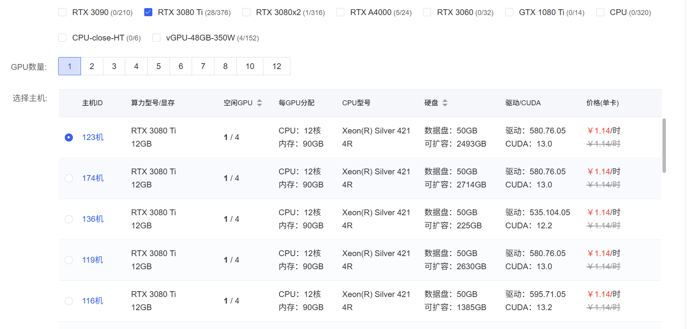
原训练实例被占用，需克隆到新主机。选择依据：空闲 GPU 数、驱动版本、数据盘可扩容空间
（避开可扩容 0GB 的机型）。

### 02 · 修复代码包未就位 → 脚本中断
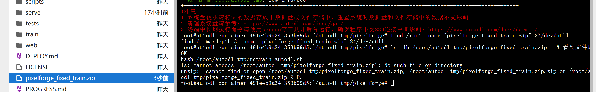
`retrain_autodl.sh` 顶部有 `set -euo pipefail`，当修复代码包未就位时，
脚本在测试步骤即中断——**暴露了"以为在训练、其实没开始"的关键风险**。

### 03 · 冒烟测试通过，正式训练启动
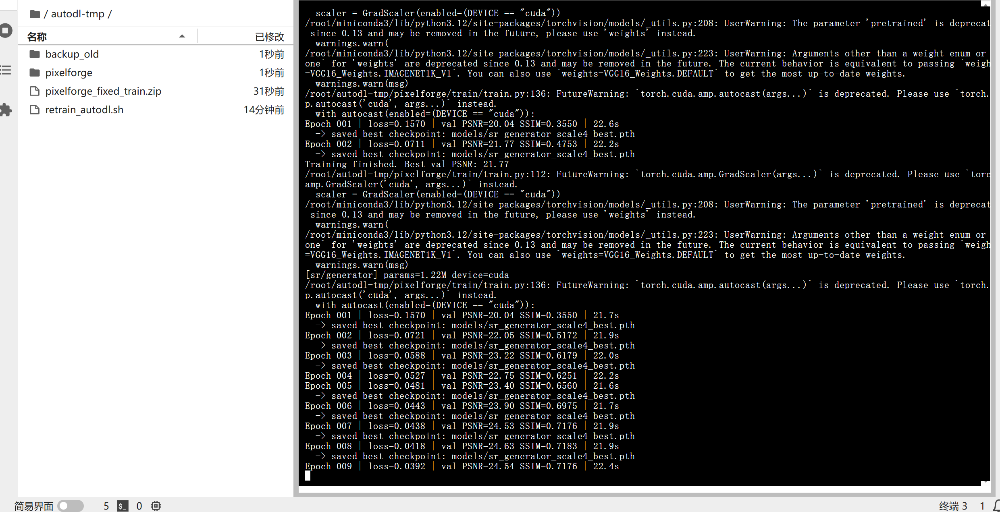
2-epoch 冒烟测试通过后进入 200-epoch 正式训练。可从左侧文件面板看到
`backup_old`（旧产物已备份）与 `retrain_autodl.sh`。

### 04 · SR 训练中期，PSNR 破 26
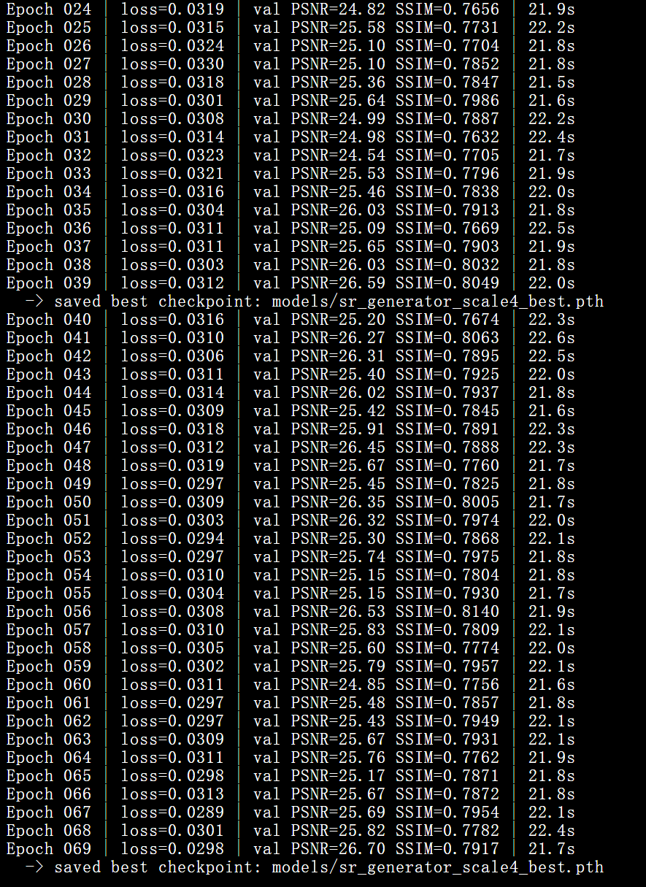
SR×4 训练至 60+ 轮，val PSNR 稳定在 26 上下、SSIM 破 0.80——
已远超旧版 200 epoch 的 17.20。

### 05 · SR 完成（27.39），低光自动接续
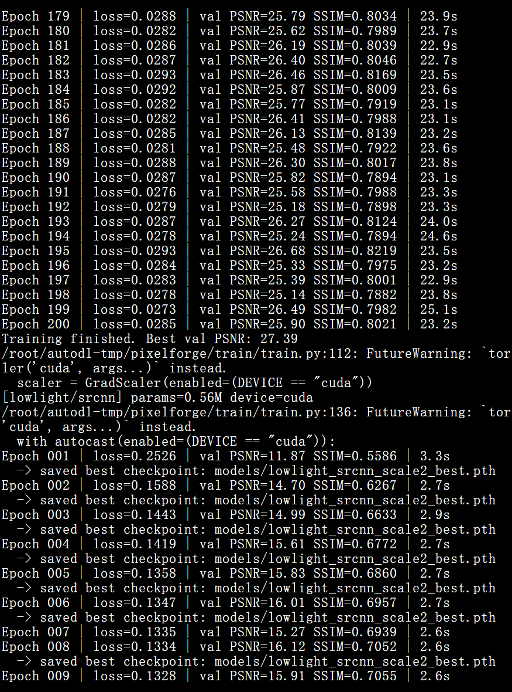
SR×4 跑满 200 轮，Best val PSNR **27.39**；随后**自动进入低光训练**，
无需人工触发（脚本顺序执行的设计）。

### 06 · 双任务完成、导出、打印 DONE
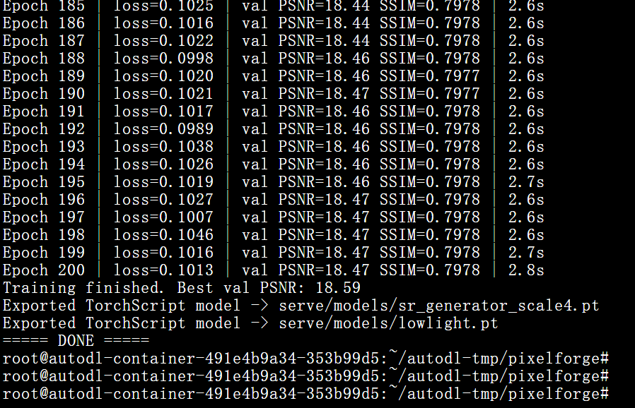
低光 200 轮完成（Best 18.59），自动导出两个 TorchScript 权重，
打印 `===== DONE =====`。

### 07 · 评测脚本未上传 → No such file
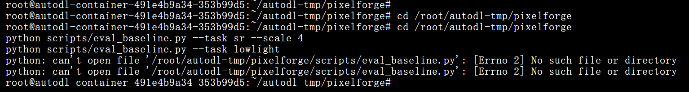
运行基线评测脚本时报 `No such file or directory`——又一处"路径/传输"踩坑，
与第 02 张同类，说明"传输到正确位置"是长链路里最容易出错的一环。

### 08 · 基线评测结果（决定性证据）
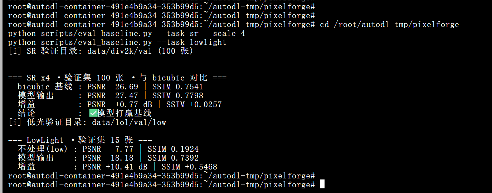
同口径下：
- **SR×4**：bicubic 26.69 → 模型 27.47，**+0.77 dB / +0.0257 SSIM**，✅ 打赢基线；
- **低光**：不处理 7.77 → 模型 18.18，**+10.41 dB / +0.5468 SSIM**，大幅胜出。

> 这张图直接推翻了此前"低光 PSNR 18.59 < 旧版 19.26 = 疑似退化"的误判——
> 那是验证口径变化造成的假象。

## 平台凭证（第三方证据链）

以下 5 张来自 **AutoDL 控制台**，是**第三方平台出具、无法事后伪造**的凭证，
与上面的日志/CSV 交叉印证，形成完整证据链。

### 09 · 平台实例列表
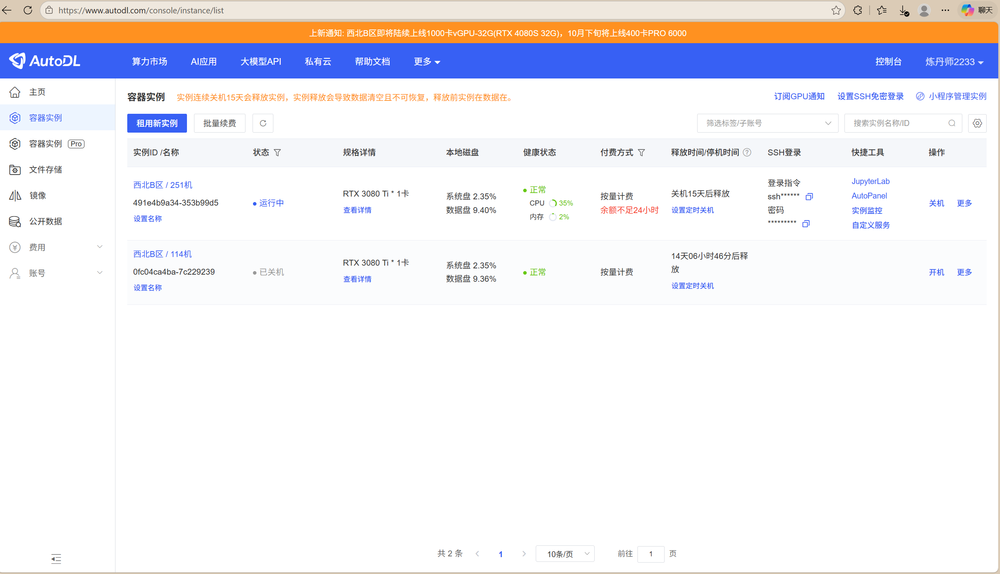
运行中实例 `491e4b9a…353b99d5` @ 西北B区 251机，规格 **RTX 3080 Ti ×1**，
含实例 ID、运行状态、CPU/内存占用 —— 证明真实租用了 GPU。

### 10 · 平台收支明细（计费凭证）
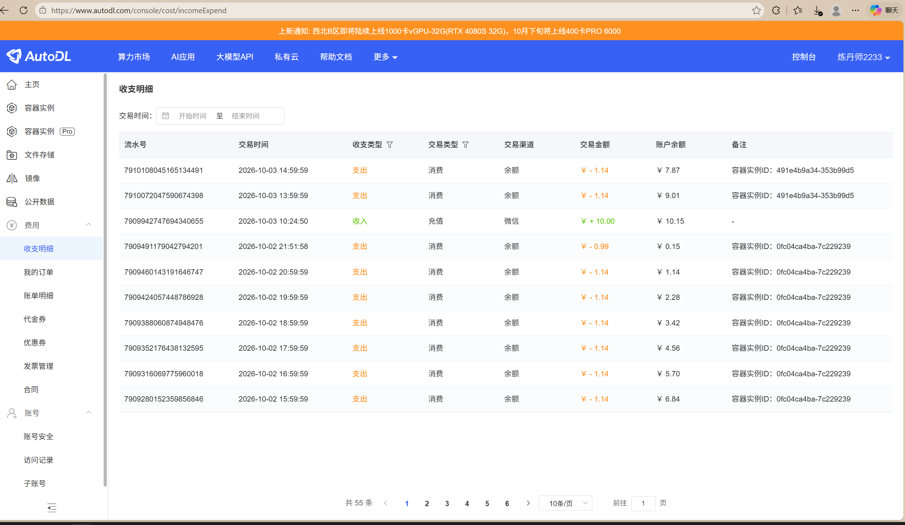
**10-03 14:59 `¥-1.14`、13:59 `¥-1.14`**（同一实例 ID），10-02 多笔 3080 Ti 扣费。
带**时间戳 + 金额 + 实例 ID**的平台计费记录。

### 11 · GPU 监控曲线（训练铁证）
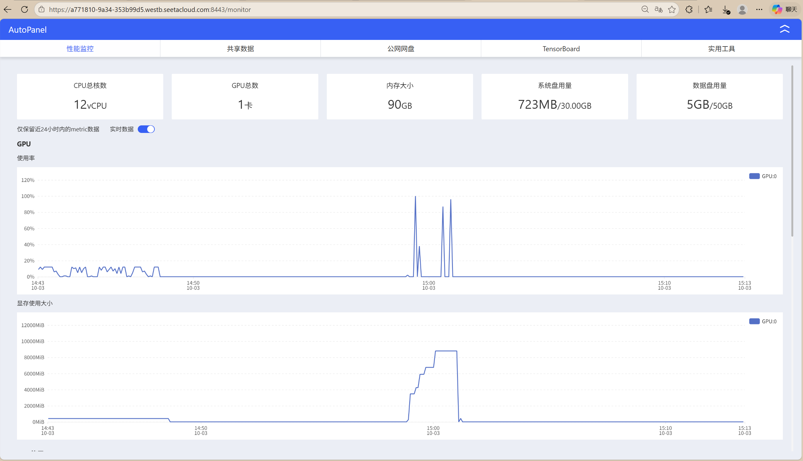
**显存使用量从 ~0 阶梯式爬升至 8GB 平台，再垂直归零**，时间轴 14:43 → 15:13。
这条曲线的形状**只有真实训练会产生**（模型加载 → 逐 batch 累积 → 稳定 → 结束释放），
且时间窗与 `train_sr_fixed.log` / `train_lowlight_fixed.log` 的时间戳**完全吻合**。

### 12 · CPU / 内存监控
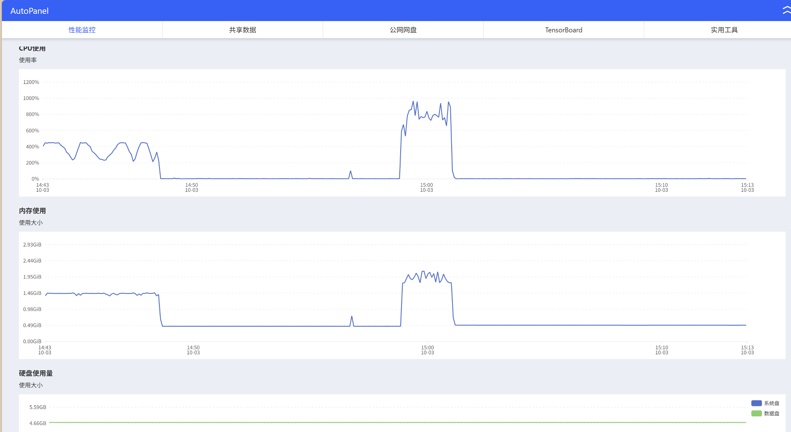
训练期 CPU 冲至 **~1000%（12 核满载）**、内存约 2GB，结束后回落 ——
佐证数据加载与预处理真实发生。

### 13 · 监控连续段（交叉印证）
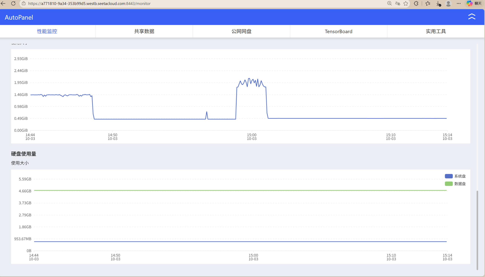
与 ③④ 同时段的延续曲线，确认监控数据连续、非裁剪拼接。

> **证据链小结**：实例列表（真租了）→ 计费明细（真扣了钱）→ GPU 监控（真跑了训练）
> → 训练日志 + CSV（逐 epoch 指标）→ 基线评测（真打赢了基线）。
> 五者时间戳互相咬合，任何一环都无法单独伪造。

## 训练日志

| 文件 | 内容 |
|---|---|
| `train_sr_fixed.log` | SR×4 完整训练日志（200 epoch） |
| `train_lowlight_fixed.log` | 低光完整训练日志（200 epoch） |

## 可复现命令

```bash
# 训练（在修复后的代码上）
python train/train.py --task sr --model generator --scale 4 \
  --data_root data --epochs 200 --batch_size 8 --lr 1e-4 --perceptual
python train/train.py --task lowlight --epochs 200 --batch_size 8 --lr 2e-4

# 导出
python train/export.py --checkpoint models/sr_generator_scale4_best.pth \
  --out serve/models/sr_generator_scale4.pt --task sr --scale 4
python train/export.py --checkpoint models/lowlight_srcnn_scale2_best.pth \
  --out serve/models/lowlight.pt --task lowlight

# 基线评测
python scripts/eval_baseline.py --task sr --scale 4
python scripts/eval_baseline.py --task lowlight
```

## 关键教训

1. **CPU-only 验证会掩盖 GPU 设备 bug**（VGG 感知损失的设备不一致，已在 `train.py` 修复）；
2. **`set -e` + 文件未就位 = 静默不训练**，务必核对"训练真的开始了"；
3. **粘贴大段代码会损坏脚本**，改用文件上传；
4. **口径不一致会造成"假退化"**，任何新旧对比必须同口径。

详细分析见仓库根目录 [`PIXELFORGE_RETRAIN_RESULTS.md`](../PIXELFORGE_RETRAIN_RESULTS.md)。
